# אפיון פונקציונלי — One (מערכת שידוכים מבוססת AI)

> **גרסה**: 3.1 — Rating System + Sequence Diagrams
> **עדכון אחרון**: 2026-10-07
> **דומיין**: joinone.io

---

## 1. סקירה כללית

### 1.1 מהות המערכת
One היא פלטפורמת שידוכים שמשתמשת בשיחות AI כדי לבנות פרופיל אישיות עמוק, ואז מתאימה בין משתמשים על בסיס ציון תאימות רב-ממדי. המשתמשות משוחחות בעברית בצורה טבעית, המערכת מנתחת את תכונות האישיות, הערכים וסגנון התקשורת שלהן, ומריצה אלגוריתם התאמה למציאת שותפות מתאימות.

### 1.2 קהל יעד נוכחי
נשים המחפשות נשים (WW — Women for Women). המערכת תומכת טכנית בכל הג'נדרים אך השיווק והתוכן מכוונים כרגע ל-WW.

### 1.3 מחסנית טכנולוגית
| רכיב | טכנולוגיה |
|-------|-----------|
| Backend | Node.js + Express + TypeScript |
| Frontend | React 18 + Vite + Inline Styles |
| מובייל | PWA (Progressive Web App) + אפליקציית Android (Capacitor) |
| אימות | Supabase (Google OAuth + Magic Link + OTP) |
| AI — שיחות וניתוח | OpenAI GPT-4o |
| AI — סיכומים | OpenAI GPT-4o-mini |
| מסד נתונים | PostgreSQL (Railway) |
| Deployment | Railway (auto-deploy מ-GitHub) |
| אחסון קבצים | Railway Volume (`/app/data/uploads`) |
| Rate Limiting | `express-rate-limit` |

### 1.4 סביבות
| סביבה | Branch | דומיין | DB |
|--------|--------|--------|-----|
| Production | `main` | joinone.io | nozomi.proxy.rlwy.net |
| Staging | `staging` | Railway auto URL | zephyr.proxy.rlwy.net |
| Local Dev | — | localhost:3000/3001 | staging DB |

---

## 2. ארכיטקטורה כללית

### 2.1 ארבע מערכות ליבה

```
┌─────────────────┐     ┌──────────────────┐     ┌─────────────────┐     ┌─────────────────┐
│  1. שיחה (Chat) │ ──► │  2. סיכום        │ ──► │  3. ניתוח       │ ──► │  4. התאמה       │
│  chatManager    │     │  summarizer      │     │  analysis agent │     │  matching alg.  │
│  prompts A-E    │     │  structured JSON │     │  60+ traits     │     │  Stage 1+2      │
└─────────────────┘     └──────────────────┘     └─────────────────┘     └─────────────────┘
```

### 2.2 זרימת נתונים (Data Flow)
```
משתמשת משוחחת (new_chat) → conversation_messages (DB)
         ↓
כל 8 הודעות → summarizer → user_chat_summaries (JSON מובנה)
         ↓
שיחה קוגניטיבית (new_chat_cognitive) → conversation_messages (DB)
מבחן טעם (new_chat_taste) → conversation_messages (DB)
         ↓
שיחה כללית נסגרת → auto-analysis הרצה #1
כל הערוצים הושלמו → auto-analysis הרצה #2
         ↓
סוכן ניתוח → user_traits (DB) → matching → candidate_matches → matches
         ↓
Claude כותב תובנות (insights) → users.personal_insights_full
Claude כותב כרטיס התאמה (match card) → matches.match_card_data
```

---

## 3. מערכת השיחה (Conversation System)

### 3.1 סקירה
מערכת השיחה היא הממשק העיקרי של המשתמשת עם One. השיחה מתנהלת בעברית, מובלת על ידי AI (GPT-4o) שעוקב אחרי מכונת מצבים (state machine) של מיקרו-נושאים. קוד ראשי: `chatManager.ts` (1103 שורות).

### 3.2 ערוצי שיחה (Chat Channels)
למערכת 11 ערוצי שיחה, כל אחד עם היסטוריה נפרדת:

| ערוץ | guide value | תיאור | כלול בניתוח |
|------|------------|--------|-------------|
| שיחה כללית | `new_chat` | שיחה עיקרית — 14 מיקרו-נושאים | כן |
| קוגניטיבי | `new_chat_cognitive` | שאלות סימולציה לניתוח חשיבה | כן |
| מבחן טעם | `new_chat_taste` | תגובות לפרופילים מוכנים | כן |
| QA סטטוס | `qa_status` | שאלות על סטטוס התהליך | לא |
| QA חיפוש | `qa_search` | שאלות על חיפוש | לא |
| QA מערכת | `qa_system` | שאלות על המערכת | לא |
| QA כללי | `qa_general` | שאלות כלליות | לא |
| QA על עצמי | `qa_about_me` | שאלות לגבי מה שהמערכת למדה | לא |
| QA תובנות | `qa_insights` | דיון על התובנות | לא |
| QA חידוד | `qa_refine` | הוספה וחידוד מידע | לא |
| QA משוב התאמה | `qa_match_feedback` | משוב על התאמה | לא |

### 3.3 זיהוי כוונה (Intent Detection)

`detectIntent()` מסווג כל הודעה ל-3 קטגוריות לפי regex patterns:

**"profile"** (נבדק ראשון) — שאלה על עצמי:
- `מה למדת`, `מה אתה יודע`, `מה גילית`, `ספר לי על עצמי`, `תובנות`
- `מה הבנת עליי`, `מה אתה חושב עליי`, `תכונות שלי`, `מה מאפיין אותי`
- `mbti`, `big five`, `schwartz`, `טיפוס`, `אישיות`, `ביג פייב`, `ערכים שלי`

**"system"** (נבדק שני) — שאלה על התהליך/מערכת:
- `איך עובד`, `איך מוצאים`, `מה התהליך`, `מה קורה אחרי`, `מתי אקבל התאמה`
- `על בסיס מה`, `מה המערכת`, `בדיקת תמונה`, `ציון התאמה`
- `למה שואל`, `למה רלוונטי`, `קצת חופר` (מטא-שאלות)
- `מה הסטטוס שלי`, `איפה אני עומד`, `מתי אמצא התאמה`

**"general"** — ברירת מחדל

**זיהויים נוספים:**
- `detectPhase()`: ≤6 הודעות → "opening", ≤20 → "middle", >20 → "deep"
- `isClarificationQuestion()`: הודעה ≤60 תווים + `?` + מתחילה ב-"מה"/"למה"/"איך"/"לא הבנתי"

### 3.4 מצב שיחה (ConversationState)

נשמר ב-`user_chat_summaries.topic_injection_counts` (JSONB):
```typescript
{
  current_topic_index: number;  // 0–13 (14 = הכל הושלם)
  turn_in_topic: number;        // 0 = שאלת פתיחה, 1 = העמקה
  closing_stage: number;        // 0=רגיל, 1=תובנה, 2=פרידה, 3=סגור
  off_topic_turns: number;      // תורות רצופות של system/meta
}
```

### 3.5 מיקרו-נושאים — 14 נושאים עם שאלות פתיחה

| # | ID | שאלת פתיחה | follow-ups |
|---|-----|-----------|------------|
| 0 | `general` | "איך נראה יום רגיל שלך? במה אתה עוסק?" | — |
| 1 | `career_basics` | "מה למדת, ואם בא לך לספר — איפה?" | 1 |
| 2 | `career_deep` | "אם לא היית צריך לדאוג לכסף בכלל – היית נשאר בתחום שבו אתה עוסק או שובר לכיוון אחר?" | 5 |
| 3 | `relationship_past` | "תאר/י לי קצת את מערכת היחסים האחרונה שהייתה לך. מה עבד ומה לא?" | 1 |
| 4 | `relationship_patterns` | "כשיש ריב בזוגיות — אתה צריך לדבר מיד, או לקחת זמן ולהירגע?" | 5 |
| 5 | `personality_general` | "איך אנשים קרובים אליך היו מתארים אותך?" | 1 |
| 6 | `personality_conflict` | "כשיש לך קונפליקט עם מישהו קרוב — איך זה נראה בדרך כלל?" | 4 |
| 7 | `family` | "ספר/י לי קצת על המשפחה שלך — מה מאפיין אותם? כמה שונים/דומים לך?" | 1 |
| 8 | `fun_lifestyle` | "איזה ערב נשמע הכי כיף: בר, הופעה, סרט, מסעדה, מסיבה, או שיחה על מרפסת?" | 4 |
| 9 | `values_beliefs` | "יש דעות פוליטיות, חברתיות או אמונות שבעיניך הן קו אדום בזוגיות?" | 8 |
| 10 | `values_openness` | "מה אתה חושב על אנשים שבוחרים לחיות מאוד אחרת מהמיינסטרים?" | 4 |
| 11 | `culture` | "יש נושא שאת/ה יכול/ה לדבר עליו שעות?" | 1 |
| 12 | `culture_interests` | "יש עולם שאתה מרגיש שאתה שייך אליו? הייטק, אמנות, מוזיקה, ספורט...?" | 1 |
| 13 | `social` | "רוב החברים שלך דומים לך או מגוונים מאוד?" | 3 |

**לוגיקת התקדמות**: כל נושא מקבל בדיוק 2 תורות:
1. **Turn 0**: תבנית A — AI מגיב קצר ואז שואל את שאלת הפתיחה
2. **Turn 1**: תבנית B — AI מעמיק/מבהיר, ואז מתקדם לנושא הבא

**התאמה**: אם ב-`career_basics` המשתמשת כבר הזכירה לימודים → מדלג/מתאים את השאלה

### 3.6 תבניות פרומפט (Prompt Templates A-E)

**SYSTEM_IDENTITY** (מוזרק לכל תבנית):
```
CRITICAL RULES — You are part of One (joinone.io), a matchmaking system based on deep
personality analysis. We are in early MVP stage.
- One presents ONE match only — the person with the highest compatibility.
- NEVER refer to other apps (Tinder, Bumble, etc.)
- NEVER say you are "just a chatbot"
- NEVER refer to specific UI buttons you're not certain about
```

| תבנית | מתי | מה עושה | כללים מרכזיים |
|--------|------|---------|---------------|
| **A** | turn 0 בנושא | מגיב 1-2 משפטים → שואל את השאלה הנדרשת | לא להמציא שאלה אחרת; שאלה אחת בלבד; לא לסגור שיחה; לגוון פתיחות (לא תמיד "נשמע ש...") |
| **B** | turn 1 בנושא | מעמיק אם צריך הבהרה, או עובר הלאה | follow-up רק אם התשובה דורשת הבהרה; אסור "איך זה משפיע על הזוגיות שלך?"; שאלה אחת מקסימום |
| **C** | שאלת profile/system | עונה בקצרה → "אפשר להמשיך?" | 2-3 משפטים; כנות; אם שואלים "למה רלוונטי" → הסבר שזה לפרופיל אישיות |
| **D** | closing_stage = 3 | תגובה קצרה, ללא שאלות חדשות | אם משתמשת רוצה להוסיף מידע → קבלה חמה; מפנה לתובנות/channels |
| **E-Insight** | closing_stage 1→2 | תובנה קצרה על האישיות → "דייקתי?" | 2-3 משפטים; לא מראה חיצוני; לא שיפוטיות; חיובי |
| **E-Final** | closing_stage 2→3 | פרידה חמה עם טקסט סגירה קבוע | "תודה על הפתיחות! מתחילים לנתח...נעדכן כשנמצא אפשרויות." |

### 3.7 מכונת סגירה (Closing State Machine)
```
closing_stage 0 → שיחה פעילה (14 מיקרו-נושאים רצים)
                   כש-current_topic_index ≥ 14 →
closing_stage 1 → תבנית E-Insight (תובנה + "דייקתי?") → מיידי →
closing_stage 2 → תבנית E-Final (פרידה + טקסט קבוע) → מיידי →
closing_stage 3 → תבנית D (תגובות קצרות, ללא שאלות)
```

**חשוב**: `saveConversationState` חייב `await` — fire-and-forget גרם לאובדן closing_stage.

**closingStage מוחזר בתגובת API** → Frontend מציג באבלים post-close.

### 3.8 ניתוב לפי ערוץ

#### new_chat (שיחה כללית)
```
הודעה → detectIntent()
  → system/profile → buildPromptC(), off_topic_turns++
  → general:
      closing_stage ≥ 3 → buildPromptD()
      closing_stage 2 → buildPromptEFinal(), stage→3
      closing_stage 1 → buildPromptEInsight(), stage→2
      turn_in_topic == 0 + clarification → buildPromptC() (נשאר באותו נושא)
      turn_in_topic == 0 → buildPromptA(), turn→1
      turn_in_topic ≥ 1 → buildPromptB(), advance to next topic
```

#### new_chat_cognitive (קוגניטיבי)
- פרומפט נפרד מ-`prompts/cognitive-chat.txt`
- בנק 27 שאלות סימולציה, AI בוחר ~6
- **סף סגירה**: 7 הודעות משתמשת (גם ל-couples)
- Re-entry detection: אם ההודעה מבקשת cognitive והשאלה האחרונה עדיין ממתינה → תזכורת
- בסגירה: AI נותן סגירה חיובית ללא תובנות אישיות → `closingStage: 3`

#### new_chat_taste (מבחן טעם)
- פרומפט בסיס: `prompts/taste-test-chat.txt`
- **בחירת בנק פרופילים**:
  - אישה + same-sex → `taste-profiles-female-ff.txt`
  - אישה + opposite-sex → `taste-profiles-female.txt`
  - גבר + same-sex → `taste-profiles-male-mm.txt`
  - גבר + opposite-sex → `taste-profiles-male.txt`
  - "שניהם" → combined (48 פרופילים)

- **סדר פרופילים**: `[0, 3, 9, 14, 11, 17, 21]` (7 פרופילים מגוונים)
  - Couples: 5 פרופילים בלבד
  - "שניהם": מחליף זכר/נקבה

- **זרימת שלבים** (לפי `tasteUserMsgCount`):
  1. שאלות טעם כלליות (2-3 שאלות על משיכה)
  2. Deal-breaker 1: lifestyle (עישון, חיות, תזונה)
  3. Deal-breaker 2: life stage (גרוש/ה, ילדים)
  4. הסבר על הפרופילים + "מוכנה?"
  5. פרופיל ראשון
  6–... : פרופילים נוספים (אם תשובה קצרה < 3 משפטים → מבקש הרחבה)
  7. אחרי 6 פרופילים (`TASTE_MIN_PROFILES = 6`): סיכום ביניים + "רוצה עוד?"
  8. סיום: סיכום דפוס + סגירה

- פרופילים הם **"כלי אבחוני"** — אסור "פיקטיביים"/"בדויים"

#### qa_about_me / qa_insights (Q&A אישי)
- מוזרק: `PROFILE_CONTEXT`, פרופיל עשיר (Big Five, Schwartz, MBTI, תכונות חיוביות), סיכום שיחה, 15 הודעות אחרונות, `personal_insights_full`
- **זרימת שאלות כיול** (calibration):
  - זיהוי נושא (enneagram/mbti/bigfive/values/attachment) → 3 שאלות כיול ממוקדות
  - שלב 1: שאלת דעה → שלב 2: הצעת כיול → שלבים 3-5: 3 שאלות → סגירה
  - בנקי שאלות נפרדים לזכר ולנקבה
- **זיהוי חשש אקס/מכר/ה**: regex מזהה הזכרת אקסים → הנחיות על בדיקת תמונות לפני match

#### qa_system / qa_status / qa_search / qa_refine / qa_general / qa_match_feedback
- בסיס: `SYSTEM_CONTEXT` + כללי תקשורת (ישיר, קצר, שפה טבעית, לא FAQ)
- `qa_search/refine/match_feedback`: מוזרק גם `personal_insights_full`
- `qa_match_feedback`: הוראות ספציפיות לשיחת משוב (חמה, תומכת)
- `qa_general`: זיהוי שיחה שנפתחה על ידי admin → המשך טבעי

### 3.9 Agent Context Injection

**תנאים להזרקה**:
- לא ב-pool **ו** ערוץ לא QA → **ריק** (לא מוזרק)
- ב-pool **או** ערוץ QA → מוזרק

**מקורות**:
- `system_summary_general` — לכל המשתמשים
- `system_summary_male` / `system_summary_female` / `system_summary_female_ff` — לפי gender + looking_for
- `users.agent_context` — per-user
- `users.self_frozen` — מודיע ל-AI שהמשתמשת הקפיאה חיפוש

**כללי בטיחות**: Closed-World Rule (מה שלא בהקשר = לא ידוע), אסור לצטט, אסור להמציא פרטי התאמות

### 3.10 RAG — הקשר חכם
Query נבנה מ-`lastAssistantMessage + message`.

3 מקורות:
1. **System RAG** (`scope=system`) — 53 chunks: זהות, תהליך, ניתוח, התאמות, מראה, מודלים, UI, תמיכה
2. **User Memory RAG** (`scope=user`) — chunks לפי user_id
3. **Live State** — `getAgentSafeLiveState()` מ-DB (סטטוס match, וכו')

- **Embedding**: `text-embedding-3-small`; סף: 0.30
- ב-`qa_about_me/insights/search/refine/match_feedback`: chunks מקטגוריית insights מסוננים (כי insights מוזרק ישירות)

**מידע התקדמות** (כש-`closing_stage == 0` ו-`current_topic_index > 0`):
```
(Internal note: conversation progress {done}/14 topics (~{pct}%).
If user asks how much is left or says they're tired — tell approximately
how much is left, explain importance for analysis, say they can continue later.)
```

### 3.11 מסכם (Summarizer)

**טריגר**: כל 8 הודעות user (`SUMMARY_INTERVAL = 8`), מינימום 6 הודעות (`MIN_MESSAGES_FOR_SUMMARY = 6`)

**מודל**: GPT-4o-mini, temperature 0.3, max_tokens 800, JSON mode

**סכמת Summary (8 שדות)**:
```typescript
{
  general_info?: string;       // שם, גיל, מגורים, מצב משפחתי
  occupation?: string;         // תחום עיסוק/לימודים
  background_culture?: string; // רקע תרבותי, מוזיקה, ספרים
  social_style?: string;       // חברים, סגנון חברתי, משפחה
  taste_and_style?: string;    // טעם, סגנון, תחביבים, "שבט"
  relationships?: string;      // מה מחפשת בזוגיות, ניסיון קודם
  values?: string;             // ערכים מובילים, עמדות
  intellectual_world?: string; // תחומי עניין, סגנון חשיבה
  notable_quotes?: string[];   // עד 3 ציטוטים בולטים
}
```

**עדכון מצטבר**: אם קיים סיכום קודם — AI מעדכן (לא מוחק) אלא אם יש סתירה.

**שמירה**: upsert ל-`user_chat_summaries` עם `ON CONFLICT (user_id) DO UPDATE`

### 3.12 ניתוח אוטומטי (Auto-Analysis)

**הרצה #1** (`maybeAutoAnalyzeAfterChat`):
- טריגר: שיחה כללית נסגרת (`closing_stage ≥ 3`)
- תנאי: `analysis_run_count === 0`
- תוצאה: ניתוח ראשוני גם ללא cognitive/taste

**הרצה #2** (`maybeAutoAnalyzeAfterAll`):
- טריגר: כל הערוצים הושלמו
- תנאי: `analysis_run_count === 1`
- Completion thresholds: cognitive `closing_stage ≥ 3` OR `≥7 msgs`; taste `closing_stage ≥ 3` OR `≥10 msgs`
- תוצאה: ריאנלזה עם כל הנתונים → יצירת job `"completion"` ב-pipeline

**זרימת הרצה** (`runAnalysis()`):
1. מעלה `analysis_run_count` + `auto_analyzed = TRUE` + `last_analysis_at = NOW()` (מיידי, מונע כפילות)
2. `buildAnalysisTranscript()` — אם < 100 תווים → abort
3. `buildAnalysisInput()` → `runAnalysisAgent()` → `saveAnalysisToDb()`
4. `saveAnalysisRun()` (debug data לadmin)
5. `updateCognitiveScore()`
6. `computeCoverage()`
7. הרצה #2 בלבד: `createJob(userId, "completion")`

**מקסימום 2 הרצות אוטומטיות**. Admin יכול להריץ ידנית ללא הגבלה.

### 3.13 בניית Transcript לניתוח (`buildAnalysisTranscript`)

3 חלקים מ-`conversation_messages`:
1. **Part 1** — "סימולציות ודילמות": guide IS NULL OR (guide != 'psychologist' AND guide NOT LIKE 'new_chat%')
2. **Part 2** — "שיחת עומק (פסיכולוג)": guide = 'psychologist'
3. **Part 3** — "שיחה חופשית": guide LIKE 'new_chat%'

כותרת: "נתח את כל התמלילים. Part 1 - מעבדה, Part 2 - שיחת עומק, Part 3 - שיחה חופשית. שלב לפרופיל אחד מדויק."

**Fallback**: אם אין conversation_messages → נסוג לטבלת `profiles` (raw_answer)

### 3.14 חישוב כיסוי (Coverage)

**per-trait classification**:
- `met`: confidence ≥ required_confidence
- `below`: confidence < required
- `missing`: אין רשומה

**Readiness score** (0–1): ממוצע משוקלל (met × 1.0, below × conf/reqConf, missing × 0)

**Outputs**: `coverage_pct`, `readiness_score`, `ready_for_matching` (≥ 0.9), `unmet_traits` (משקל ≥ 3)

### 3.15 טיפולים מיוחדים

**Couple Tester** (`test_user_type === "Couple Tester"`):
- `COUPLE_TESTER_INSTRUCTION` מוזרק — שאלות על זוגיות לפני הנוכחית
- Taste test: 5 פרופילים (במקום 7)
- `isFullyCovered()` סיפים נמוכים: cognitive ≥4 (במקום 7), taste ≥5

**WW** (נשים לנשים):
- הקשר WW מוזרק: "One היא אפליקציה לנשים שמחפשות נשים, פתוחה לכל הספקטרום הקווירי"
- AI משתמש בשפה נשית עקבית ומפנה ל"בת זוג"

**`isFullyCovered()`**: `chatDone` (8 שדות summary מלאים) + `cogDone` (≥7) + `tasteDone` (≥7) = `allDone`

---

## 4. מערכת הניתוח (Analysis System)

### 4.1 סקירה
מערכת הניתוח מחלצת **75 תכונות פנימיות** + **10 תכונות מראה** מתמלילי שיחה באמצעות GPT-4o. קוד ראשי: `agent.ts` (766 שורות), `loader.ts` (309), `cognitiveScore.ts` (62), `safeOutputLayer.ts` (660).

### 4.2 זרימת ניתוח מלאה
```
buildAnalysisInput()
  → loadInternalTraitDefs() + loadExternalTraitDefs() (מ-DB, בלי cache)
  → assembles transcript + definitions

runAnalysisAgent()
  → setTraitLookups(), setExternalPossibleValues(), setTextTypeTraits()
  → load 9 prompt files
  → groupTraitsByCategory() (ללא text traits)
  → split: career_prestige → General Info
  → merge: Big Five + Schwartz → "Personality"
  → append text traits → General Info
  → SEQUENTIAL LOOP: per group →
      runOneGroupCall(GPT-4o, temp=0.05, max_tokens=4000, json_mode)
  → runExternalCall(GPT-4o, temp=0.05, max_tokens=2000, json_mode)
  → merge results, validate, deduplicate

saveAnalysisToDb()
  → upsert user_traits (COALESCE on weight_for_match)
  → upsert user_look_traits (direct assign personal_value)
  → UPDATE users SET deal_breakers
  → save femininity_preference (look_trait_id=13)

saveAnalysisRun() → INSERT analysis_runs (debug data)
updateCognitiveScore() → compute + UPDATE users
```

### 4.3 8+1 קבוצות פרומפט

| # | קבוצה | קובץ פרומפט | מספר תכונות | עיקרי |
|---|--------|-------------|-------------|-------|
| 1 | Cognitive Profile | `cognitive-system.txt` | 9 | חשיבה אנליטית, מופשטת, גמישות, דיוק, ביטוי, עומק (ללא career_prestige) |
| 2 | Personality | `bigfive-schwartz-system.txt` | 16 | Big Five (5) + Schwartz (11) — מיזוג לפרומפט אחד |
| 3 | Communication Tone | `communication-tone-system.txt` | 3 | עוצמה אנרגטית, אסרטיביות, נוכחות כריזמטית |
| 4 | Personal Style | `personal-style-system.txt` | 20 | 19 סגנון + gender_conformity — הקשר תרבותי ישראלי |
| 5 | Attitudes | `attitudes-system.txt` | 6 | ימין, שמאל, אקטיביזם, דתיות, חילוניות, נוקשות |
| 6 | Emotional Profile | `emotional-profile-system.txt` | 9 | EQ, מודעות עצמית, ביטוי רגשי, 3 attachment styles |
| 7 | General Info | `general-info-system.txt` | 8+text | career_prestige, אוהב בע"ח, צמחוני, toxicity, trollness, trans, deal_breakers |
| 8 | MBTI / Enneagram | `mbti-system.txt` | 15 | 6 MBTI (ללא E/I) + 9 Enneagram types |
| +1 | External (Look) | `external-system.txt` | 10 | תכונות מראה מהשיחה (personal_value + desired_value) |

**Fallback**: `group-system.txt` לקבוצות ללא פרומפט ייעודי

### 4.4 רשימת תכונות מלאה — 75 תכונות פנימיות

#### Cognitive Profile (10)
`analytical_reasoning`, `abstract_thinking`, `cognitive_flexibility`, `conceptual_precision`, `verbal_articulation`, `verbal_reasoning`, `depth_of_thought`, `social_intuitive_intelligence`, `intellectualism`, `career_prestige`

#### Communication Tone (3)
`energetic_intensity`, `assertiveness_forcefulness`, `charismatic_presence`

#### Big Five (5)
`extraversion`, `conscientiousness`, `agreeableness`, `neuroticism` (מוצג כ-"עוצמת תגובה רגשית"), `openness_to_experience`

#### Schwartz Values (11)
`hedonism` (נהנתנות), `achievement` (הישגיות), `power` (כוח), `self_direction` (עצמאות), `stimulation` (גירוי), `security` (ביטחון), `conformity` (ציות), `tradition` (מסורת), `benevolence` (נדיבות), `universalism` (אוניברסליות), `spirituality` (רוחניות)

#### Emotional Profile (9)
`eq`, `self_awareness`, `emotional_expressiveness`, `positivity`, `warmth`, `emotional_intensity`, `attachment_secure`, `attachment_anxious`, `attachment_avoidant`

#### Personal Style (20)
`mainstreamness`, `oriental`⚠, `broad_appeal`, `family_of_origin_closeness`, `childishness`, `humor`, `party_orientation`, `hipsterishness`, `geekiness`, `hippie_style`, `soviet_style`⚠, `theatricality`, `metropolitan_orientation`, `achievement_status_orientation`, `cultural_currency`, `style_polish`, `high_culture_orientation`, `rural_communal_style`, `gender_conformity`⚠

(⚠ = sensitive — default 50, confidence 0.1 כשאין ראיות)

#### Attitudes (6)
`right_wing`⚠, `left_wing`⚠, `social_activism`, `religiosity`⚠, `secularity`⚠, `value_rigidity`

#### MBTI (6)
`sensing`, `intuition`, `thinking`, `feeling`, `judging`, `perceiving`
(E/I = `extraversion` מ-Big Five; לא zero-sum — כל pole נמדד עצמאית)

#### Enneagram (9)
`enneagram_type_1` עד `enneagram_type_9`

#### General Info (8)
`career_prestige`, `loves_animals`, `vegetarian`, `serious_relationship_intent`, `appearance_sensitivity`⚠, `toxicity` (internal_use)⚠, `trollness` (internal_use)⚠, `trans` (special)⚠

### 4.5 עקרונות ניקוד
- **טווח**: 0–100 לכל תכונה; confidence 0–1
- **כלל ברזל**: "no compliments" — המשתמשת לא רואה ציונים
- **עיגונים**: ציון 50 = ממוצע ולגיטימי; anti-flattery חזק
- **ביטחון לפי ראיות**:
  | מקור | confidence |
  |------|-----------|
  | אין מידע | 0.1–0.15 |
  | אמירה עקיפה | 0.3–0.5 |
  | דפוס סובייקטיבי | 0.65–0.85 |
  | אמירה עובדתית ישירה | 0.8–0.95 |
- **Validation**: score מעוגל ל-2 ספרות; `weight_for_match` מותר רק ל-`analytical_reasoning` ו-`career_prestige`

### 4.6 ציון קוגניטיבי (Cognitive Score)

**מחושב רק ב-`cognitiveScore.ts`**

**תכונות ומשקלות**:
| תכונה | משקל |
|--------|------|
| `analytical_reasoning` | **3** |
| `abstract_thinking` | 1 |
| `cognitive_flexibility` | 1 |
| `conceptual_precision` | 1 |
| `verbal_articulation` | 1 |
| `verbal_reasoning` | 1 |
| `depth_of_thought` | 1 |
| `intellectualism` | 1 |
| `career_prestige` | 1 |
| `eq` | 1 |

**נוסחה**:
```
sumW = Σ(score × confidence × weight)
sumC = Σ(confidence × weight)
raw = sumW / sumC
normalized = max(0, min(100, ((raw - 10) / 80) × 100))
result = round(normalized)
```
אם `sumC === 0` → `null`

### 4.7 MBTI — חישוב מ-7 תכונות

**4 צירים**:

| ציר | לוגיקה | הערה |
|-----|--------|------|
| **E/I** | `extraversion > 55` → E; `< 50` → I; 50-55 → E (borderline) | "AI נוטה לנפח extraversion — 50-55 = borderline" |
| **S/N** | `sensing > intuition` → S; אחרת → N; שניהם null → X | כל pole עצמאי |
| **T/F** | `(thinking + 10) > feeling` → T; אחרת → F | **Thinking +10 תיקון הטיה** |
| **J/P** | `judging > perceiving` → J; אחרת → P | Tie → J |

**Alternate type**: מחושב ע"י הפיכת הממד הגבולי ביותר (הפרש ≤5)
**Borderline**: כש-extraversion 50-55, מוצג "ENFP/INFP"

### 4.8 Enneagram — טיפוס + Wing

1. הציון הגבוה מ-9 טיפוסים → primary type
2. **Wing חייב להיות שכן**: type 4 → wing 3 או 5; type 9 → wing 8 או 1 (מעגלי)
3. Wing = השכן עם הציון הגבוה יותר
4. תוצאה: "4w5"

**9 טיפוסים עם תיאורים בעברית**:
| טיפוס | שם | תיאור |
|-------|-----|--------|
| 1 | הרפורמיסט | עקרוני, אידיאליסטי, שואף לשלמות |
| 2 | העוזר | אכפתית, חמה, ממוקדת בצרכי אחרות |
| 3 | ההישגיסט | שאפתני, יעיל, מונע מהישגים |
| 4 | האינדיבידואליסט | רגיש, ייחודי, מחפש עומק וזהות |
| 5 | החוקר | סקרן, אנליטי, שומר גבולות |
| 6 | הנאמן | אחראי, מחויב, מחפש ביטחון |
| 7 | ההרפתקן | אופטימי, ספונטני, מחפש גיוון |
| 8 | הבוס | דומיננטי, ישיר, מגן על חלשים |
| 9 | המשכין שלום | שקט, מפשר, נמנע מעימותים |

### 4.9 סגנון התקשרות (Attachment Style)

1. ממיין `attachment_secure`, `attachment_anxious`, `attachment_avoidant` לפי ציון
2. הגבוה = dominant
3. **תוויות מרוכבות**: אם dominant = secure וציון שני ≥ 50 →
   - "בטוח-חרדתי" — "ביסודו בטוח, נוטה לחרדה ברגעי אי-ודאות"
   - "בטוח-נמנע" — "ביסודו בטוח, נוטה למרחק רגשי ברגעי לחץ"

### 4.10 שכבת פלט בטוחה (Safe Output Layer)

**SafeUserProfile** (תצוגה בסיסית):
- MBTI type + תיאור בעברית (כל 16 הטיפוסים)
- Schwartz values עם ציון > 60 (ממוין יורד)
- Big Five עם ציון > 60, **ללא neuroticism**

**DetailedUserProfile** (Insights screen):
- כל ה-traits עם רמות תיאוריות (לא ציונים)

**רמות**:
| ציון | רמה |
|------|------|
| ≥ 80 | גבוה מאוד |
| ≥ 65 | גבוה |
| ≥ 45 | בינוני |
| ≥ 30 | נמוך |
| < 30 | נמוך מאוד |

**formatRichProfileForChat()** (ל-qa_about_me):
- MBTI + alternate type + ציונים פנימיים per-dimension
- Big Five — כל 5 עם רמות + ציונים
- Schwartz — כל הערכים ממוינים
- Enneagram — primary + wing + top 4
- Attachment — dominant + כל 3 הציונים
- **Safe positive traits** (ציון ≥ 65 בלבד): חשיבה אנליטית, מופשטת, גמישות, עומק, אינטלקטואליזם, ביטוי מילולי, מודעות עצמית, EQ, אינטליגנציה חברתית, חיוביות, חום, כריזמה, כוונות רציניות, אוהב/ת בע"ח

**מוסתר מהמשתמשת לגמרי**: ציונים גולמיים, toxicity, trollness, trans, appearance_sensitivity, weight_for_match, external traits

### 4.11 שמירה ל-DB — לוגיקת Upsert

**Internal traits** — `ON CONFLICT DO UPDATE`:
- `score`, `confidence`: **תמיד נדרסים**
- `weight_for_match`, `weight_confidence`: **COALESCE** — חדש אם non-null, אחרת שומר קיים
- `source`: תמיד 'ai'

**External traits** — `ON CONFLICT DO UPDATE`:
- `personal_value`, `personal_value_confidence`: **תמיד נדרסים** (מאפשר ניקוי mirrored values)
- `desired_value`, `desired_value_confidence`, `weight_for_match`: **COALESCE**
- Mirror detection: אם LLM שכפל desired_value ל-personal_value (confidence קרוב ב-0.15) → personal_value מנוקה

**deal_breakers**: נשמר ישירות ב-`users.deal_breakers` (pipe-separated)

**אימות**: COUNT queries אחרי כל הinserts לוודא שהנתונים נשמרו

### 4.12 ניתוח חלקי (Single Group)

`runSingleGroupAnalysis(group)` — מפתחות זמינים:

| key | קבוצות traits | פרומפט |
|-----|--------------|--------|
| `cognitive` | Cognitive Profile (ללא career_prestige) | cognitive-system.txt |
| `personality` | Big Five + Schwartz | bigfive-schwartz-system.txt |
| `communication` | Communication Tone | communication-tone-system.txt |
| `style` | Personal Style | personal-style-system.txt |
| `attitudes` | Attitudes | attitudes-system.txt |
| `emotional` | Emotional Profile | emotional-profile-system.txt |
| `general` | General Info + career_prestige + text | general-info-system.txt |
| `mbti` | MBTI + Enneagram | mbti-system.txt |
| `external` | Look traits | external-system.txt |

### 4.13 הנחיות פרומפט מרכזיות

**כלל ברזל**: "no compliments" — המשתמשות לא רואות ציונים

**Cognitive**: "כל תכונה עומדת בפני עצמה" — אין להסיק תכונה קוגניטיבית מאחרת

**Personal Style (הקשר ישראלי)**:
- `geekiness`: דורש התייחסות מפורשת לגיימינג/SF/אנימה — עבודה בהייטק לא מספיקה (cap 35)
- `gender_conformity`: ניקוד שונה לגברים ונשים
- `oriental`, `soviet_style`: default 50 conf 0.1 ללא ראיות

**Attitudes**: `right_wing`/`left_wing` לא ציר אחד — שניהם יכולים להיות נמוכים (א-פוליטי)

**Emotional**: "מדבר על רגשות" ≠ "EQ גבוה"; attachment styles **לא** zero-sum

**MBTI**: E/I ציר מוחרג — משתמש ב-`extraversion` מ-Big Five

---

## 5. מערכת ההתאמה (Matching System)

### 5.1 סקירה
אלגוריתם דו-שלבי: סינון (Stage 1, `matchStage1.ts` — 674 שורות) ואז ניקוד (Stage 2, `matchStage2.ts` — 1161 שורות). IDs של traits נטענים דינמית מ-DB (ללא hardcoded IDs).

### 5.2 שלב 1 — סינון (`matchStage1.ts`)

**זרימה**:
1. טעינת trait IDs דינמית מ-`trait_definitions` + `look_trait_definitions`
2. טעינת users מ-pool (`in_matching_pool=TRUE`, `valid_person=TRUE`, `self_frozen IS NOT TRUE`)
3. Bulk-load כל `user_traits` + `user_look_traits` ל-memory maps
4. סינון מוקדם של toxic/troll users מהמאגר
5. טעינת ערים + אזורים + adjacency
6. חישוב freshness timestamps per-user
7. Nested loop על כל הזוגות (a.id < b.id) → `passesAllFilters()`
8. כתיבה ל-`candidate_matches` בטרנזקציה אחת

**סדר בדיקת סינונים** (כישלון בכל שלב = stop):
1. Gender (A→B) → 2. Gender (B→A) → 3. Age (A) → 4. Age (B) → 5. Location (A) → 6. Location (B) → 7. Height (A) → 8. Height (B) → 9. Approval rate → 10. Cognitive → 11. Sexual identity → 12. Personal traits × 5 → 13. Body type (A→B) → 14. Body type (B→A) → 15. Gender expression (A→B) → 16. Gender expression (B→A)

#### סינונים קבועים (תמיד פעילים)

**Gender**: `from.looking_for_gender === to.gender`. null/"both"/"doesnt_matter" = עובר.

**Age** — 3 רמות גמישות:
| גמישות | סובלנות |
|---------|---------|
| `not_flexible` | ±1 שנה |
| `slightly_flexible` (ברירת מחדל) | ±3 שנים |
| `very_flexible` | ±5 שנים |

**ברירות מחדל כשאין העדפות**: same-sex: ±7 שנים (+3 per decade after 30). Hetero women: -2 עד +8. Hetero men: -8 עד +2.

**Location** — 4 רמות:
| רמה | עברית | לוגיקה |
|-----|-------|--------|
| `my_city` | "לא יוצא מהעיר" | `from.city === to.city` |
| `my_area` | "באזור שלי" | overlap בין אזורי from ואזורי to |
| `bit_further` (ברירת מחדל) | "מוכן לנסוע קצת" | אזורי to ב-`region_adjacency` של from |
| `whole_country` | "כל הארץ" | תמיד עובר |

9 אזורים: גוש דן, שרון, עמקים-חוף, שפלה-מרכז, ירושלים, דרום-מערב, דרום-נגב, כרמל-חיפה, צפון. עיר יכולה להשתייך למספר אזורים. Admin override: `admin_location_override` מחליף את העדפת המשתמשת.

**Height** — 3 רמות גמישות:
| גמישות | סובלנות |
|---------|---------|
| `not_flexible` | ±2 ס"מ |
| `slightly_flexible` (ברירת מחדל) | ±5 ס"מ |
| `very_flexible` | ±10 ס"מ |

ברירת מחדל ללא העדפות: same-sex = ללא סינון. Hetero man: בת זוג ≤ גובהו. Hetero woman: בן זוג ≥ גובהה.

**Approval rate**: `|A.initial_attraction_signal - B.initial_attraction_signal| ≤ 30`. null = עובר.

**Cognitive**: `|A.cognitive_score - B.cognitive_score| ≤ 15`. null = עובר.

**Toxicity/Trollness** (pre-filter — מסיר מהמאגר לחלוטין):
- `score ≥ 70 AND confidence ≥ 0.6` → מוסר
- `toxicity_override === false` (admin approved) → bypass

**Sexual identity (Trans)**: `score > 50 AND confidence ≥ 0.6` = special. Special + non-special = עובר רק אם non-special שם `looking_for_gender = "doesnt_matter"`.

#### סינונים אישיים (effective_weight > 80)

**Effective weight**: `weight_for_match × weight_confidence × confidence`. סף: 80. בפועל personality traits (max ~10) כמעט לא מגיעים ל-80 — הסף רלוונטי בעיקר ל-look traits.

**5 תכונות אישיות**:
| תכונה | טווח מותר |
|--------|----------|
| `extraversion` | ±30 |
| `family_of_origin_closeness` | ±20 |
| `party_orientation` | ±20 |
| `religiosity` | ±20 |
| `value_rigidity` | ±20 |

**Body type**: מסנן רק כש-desired ∈ {slim, toned, muscular} + effective > 80 + personal_value_confidence ≥ 0.8

**Gender expression**: exact match required, same thresholds

**טיפול בתכונות חסרות**: trait חסר = דילוג (לא נענש)

### 5.3 שלב 2 — ניקוד (`matchStage2.ts`)

#### ציון פנימי (Internal Score)

**Gaussian similarity per-trait**:
```
rawMatch = 100 × e^(-(diff²) / (2 × 12²))     // σ = 12
```
| diff | rawMatch |
|------|----------|
| 0 | 100 |
| 5 | ~92 |
| 10 | ~70 |
| 15 | ~46 |
| 20 | ~25 |
| 30 | ~5 |

**Confidence blending** (כש-`sharedConf < 0.3`):
```
sharedConf = √(c1 × c2)                        // geometric mean
confFactor = min(1, sharedConf / 0.3)
match = rawMatch × confFactor + 50 × (1 - confFactor)
```
מטרה: מונע ענישה/תגמול כשאין נתונים. ≥0.3 = full rawMatch; <0.3 = blend toward 50.

**משקל per-trait**:
```
defWeight = traitDef.weight ?? 5
w1 = t1.weight_for_match ?? defWeight
w2 = t2.weight_for_match ?? defWeight
avgWeight = (w1 + w2) / 2
weightedWeight = avgWeight × sharedConf
```

**Final**: `internalScore = Σ(weightedWeight × match) / Σ(weightedWeight)`. null אם אין overlap.

**מוחרג**: traits עם `calc_type = "internal_use"/"special"` או `weight === 0`.

#### ציון חיצוני (External Score)

**Standard (לא-WW)**:
| תכונה | משקל |
|--------|------|
| `appeal` | 3 |
| `fitness_aesthetic` | 3 |
| `femininity_masculinity` | 2 |
| `warmth_visual` | 1 |
| `glamour` | 1 |
| `naturalness` | 1 |
| `style_polish` | 1 |
| `skin_tone_range` | 1 |

Per-trait: `traitScore = 100 - |v1 - v2|`. Overall: `Σ(traitScore × weight) / Σ(weight)`.

**WW** (שתיהן `gender="woman"` + `looking_for_gender="woman"`):
- **Femininity match** (asymmetric weakest-link):
  ```
  fem_match_A = 100 - |desired_A - personal_B|
  fem_match_B = 100 - |desired_B - personal_A|
  femScore = min(fem_match_A, fem_match_B)
  ```
  desired חסר → דילוג על אותו כיוון. שניהם חסרים → `femScore = 50`.
- **Appeal similarity**: `appealScore = 100 - |appeal1 - appeal2|` (או 50 אם חסר)
- **WW final**: `femScore × 0.7 + appealScore × 0.3`
- **צד אחד ללא תמונה**: `oneDirectionMatch × 0.35` (35% מציון מלא)
- **אין נתוני femininity כלל**: fallback ל-standard formula

#### ציון סופי
```
normal:   finalScore = internal × 0.70 + external × 0.30
sensitive: finalScore = internal × 0.65 + external × 0.35
no external: finalScore = internal
```

**Appearance sensitivity**: `appearance_sensitivity score ≥ 70 AND confidence ≥ 0.7` — **אם כל אחד** מהזוג sensitive → 65/35.

### 5.4 ציוני קטגוריה — 13 categories עם trait mappings

| # | Category | משקל | תכונות |
|---|----------|------|--------|
| 1 | Cognitive | 3 | analytical_reasoning, abstract_thinking, cognitive_flexibility, conceptual_precision, verbal_articulation, verbal_reasoning, depth_of_thought, intellectualism, career_prestige, eq |
| 2 | Emotional-Social | 1 | social_intuitive_intelligence, eq, self_awareness, positivity, warmth |
| 3 | Emotionality | 0.5 | neuroticism, emotional_intensity, emotional_expressiveness, attachment_secure, attachment_anxious, attachment_avoidant |
| 4 | Communication | 2 | energetic_intensity, assertiveness_forcefulness, charismatic_presence |
| 5 | Vibe | 0.25 | mainstreamness, conformity, openness_to_experience, gender_conformity |
| 6 | Popularity | 0.25 | oriental, mainstreamness, broad_appeal |
| 7 | Big Five | 1 | extraversion, conscientiousness, agreeableness, neuroticism (×0.5 weight), openness_to_experience |
| 8 | Schwartz | 1.5 | hedonism, achievement, power, self_direction, stimulation, security, conformity, tradition, benevolence, universalism, spirituality |
| 9 | Style | 2 | 19 תכונות Personal Style |
| 10 | Attitudes | 1.5 | right_wing, left_wing, social_activism, religiosity, secularity, value_rigidity |
| 11 | MBTI | 0.5 | extraversion, sensing, intuition, thinking, feeling, judging, perceiving |
| 12 | Enneagram | 0.5 | enneagram_type_1 עד enneagram_type_9 |
| 13 | General | (לא בprofile score) | loves_animals, vegetarian, serious_relationship_intent, appearance_sensitivity |

**הערה**: תכונות יכולות להופיע במספר קטגוריות (eq, neuroticism, extraversion, mainstreamness...).
**neuroticism**: ×0.5 weight ב-Big Five בלבד.
**External score**: משקל 3 ב-profile score (שווה ל-Cognitive).

### 5.5 התאמות לפי ג'נדר

**רק לזוגות גבר-אישה** — קטגוריות Emotionality ו-Emotional-Social:
```
combined = traitResult × 0.5 + profileMatch × 0.5
```

`profileMatch` = Gaussian comparison של ממוצעי פרופיל **עם בונוס לגבר**:
| קטגוריה | בונוס לגבר |
|---------|-----------|
| Emotionality | +10 |
| Emotional-Social | +4 |

Same-sex pairs: ציון קטגוריה רגיל ללא adjustment.

### 5.6 Profile Score

```
per-category: confFactor = min(1, rawConf / 0.3)
              weight = baseWeight × confFactor
profileScore = Σ(categoryScore × weight) / Σ(weight)
```

**Internal Profile Score**: כמו Profile Score אבל **ללא** external component.

### 5.7 סף קידום (Promotion)

```sql
(internal_score > 70 AND internal_profile_score > 70)
OR ((internal_score + internal_profile_score) / 2.0 > 70)
```

קידום: `candidate_matches` → `matches`:
- `location_expanded` OR `age_expanded` → `status = 'expanded_potential_match'`
- אחרת → `status = 'potential_match'`

### 5.8 התאמות מורחבות (Expanded)

| פרמטר | שינוי |
|--------|-------|
| גיל | +2 שנים מעבר ל-tolerance |
| מיקום | bump רמה אחת (my_city→my_area, my_area→bit_further, bit_further→whole_country) |

**בריצה רגילה**: זוגות expanded לא נמחקים גם אם לא היו עוברים סינון רגיל.

### 5.9 Force Matching (`skipAllFilters`)
- רק cognitive filter נאכף
- Age/location expanded flags מחושבים לתיוג אך לא חוסמים

### 5.10 עדיפויות ובחירה

**System Match Priority** (per-user):
```
waitingDaysScore = min(waitingDays × 5, 100)
generalMatchesScore = max(0, 100 - total_matches × 10)
goodMatchesScore = max(0, 100 - good_matches × 10)
priority = 0.4 × waitingDaysScore + 0.2 × generalMatchesScore + 0.4 × goodMatchesScore
```

**Match Selection Priority** (per-match, `approved_by_both`):
```
pairPriority = (u1.priority + u2.priority) / 2
finalPriority = 0.7 × match_score + 0.3 × pairPriority
```

**selectAndFreezeMatches()**: ממיין `approved_by_both` לפי `final_match_priority DESC`, מקדם top match per-user ל-`pre_match`, מקפיא שאר.

---

## 6. ממשק משתמשת (Frontend) — מסכי UI מפורטים

### 6.1 ארכיטקטורת ניווט
**ללא React Router** — ניהול view state-based ב-`App.tsx`:
```
View = "landing" | "register" | "welcome" | "pwa_install" | "new_chat" |
       "admin" | "auth" | "auth_callback" | "profile_setup" | "consent" |
       "couple_welcome" | "meme_dashboard" | "adi_dashboard" | "survey" | "survey2"
```

**דגל isWW** (מרכזי לכל ה-UI):
`gender === "woman" && looking_for_gender !== "man"` → מפעיל UI נשי, מסתיר שדות ג'נדר/גובה, מתאים טקסט עברי. `wwRel()` helper ממיר זכר לנקבה.

**Layout כללי**: `maxWidth: 600px` לרוב המסכים; `100%` ל-admin ו-new_chat.

### 6.2 מסע משתמשת חדשה (User Journey)

```
דף נחיתה (Landing) → התקנת PWA (מובייל) → מסך אימות (Auth)
    → OAuth Callback → הגדרת פרופיל (ProfileSetup)
    → [CoupleWelcome — רק לזוגות] → הסכמה (Consent)
    → [סקר — אם רלוונטי] → מסך ראשי (NewChat)
```

**Couple Testers**: Landing → Auth → ProfileSetup → CoupleWelcome → Consent → NewChat
**חזרה**: Auto-login מ-Supabase → NewChat ישירות
**Session expired**: Event → AuthScreen עם באנר "החיבור שלך פג תוקף"

---

### 6.3 דף נחיתה (Landing)
**מתי**: ביקור ראשון בדפדפן (לפני `sessionStorage.one_seen_landing`)

**מבנה**:
- רקע מלא עם תמונה (`/background.png`), RTL
- לוגו One (`/iconOnly.png`, 56px)
- כותרת ברוכות הבאות (מותאמת ג'נדר)
- **WW**: כותרת משנה שמסבירה שהשירות לנשים המחפשות נשים
- "איך זה עובד?" — 6 שלבים ממוספרים
- לינק "בזוגיות ורוצה לעזור?" (רק ל-forwomen)

**נתיבי כניסה**:
| נתיב | entry_point | קהל |
|------|-------------|------|
| `/` | `forwomen` | WW (ברירת מחדל) |
| `/forwomen` | `forwomen` | WW |
| `/main` | `main` | כללי |
| `/couples` | `couples` | בודקי זוגות |
| `/meme` | `meme` | קמפיין סאשה |
| `/barazany` | `barazany` | קמפיין עדי |

**אינטראקציות**:
- **"המשיכי לאפליקציה"** → שומר ב-sessionStorage, מציג PWA install (מובייל) או auth
- **לינק זוגות** → שומר `one_entry_point = "couples"`, עובר ל-auth

---

### 6.4 התקנת PWA (PWAInstallFlow)
**מתי**: אחרי landing, מובייל, לא standalone, לא native.

**4 מצבים לפי מכשיר**:

| מצב | תנאי | מה מוצג |
|-----|-------|---------|
| Standalone | כבר מותקן | דילוג אוטומטי |
| Desktop | לא מובייל | ברוך הבא + "להמשיך לאפליקציה" |
| In-App Browser | Facebook/Instagram/LinkedIn | הנחיה לפתוח בדפדפן חיצוני |
| מובייל רגיל | דפדפן רגיל | הנחיות התקנה לפי מכשיר |

**התקנה לפי מכשיר**:
- **Android** עם `beforeinstallprompt`: כפתור "התקן עכשיו" → prompt מובנה
- **iOS Safari**: הנחיה מצוירת — Share → Add to Home Screen
- **Generic**: הנחיה — תפריט → "הוסף למסך הבית"

---

### 6.5 מסך אימות (AuthScreen)
**מתי**: `view === "auth"` או `view === "landing"`

**5 מצבים פנימיים**:

#### 6.5.1 מסך ראשי (Auth Main)
- לוגו One + "Meet, as you are."
- באנר session-expired (כתום, כשרלוונטי)
- **כפתור Google OAuth** (עם לוגו Google SVG)
- חוצץ "or"
- **"Login / Register with email"** → עובר לטופס מייל
- Footer: תנאי שימוש + פרטיות
- Loading overlay בזמן OAuth

#### 6.5.2 טופס מייל (Email Form)
- שדה email (RTL placeholder, auto-focus, Enter שולח)
- **"שלחו לי קוד כניסה"** → שולח OTP
- **"חזרה"** → חזרה למסך ראשי
- לינקי troubleshooting

#### 6.5.3 הזנת קוד OTP
- 6 שדות ספרה נפרדים (44×52px כל אחד)
- Auto-focus, auto-advance בהקלדה
- Backspace מזיז אחורה
- תמיכה ב-paste (auto-submit על 6 ספרות)
- Auto-submit כשכל 6 מלאים
- Spinner בזמן אימות
- **"שינוי אימייל"** / **"שליחה מחדש"** / **"נסו דרך גוגל"**

#### 6.5.4 Magic Link נשלח
- אייקון V ירוק
- "שלחנו לך לינק להתחברות" + כתובת המייל
- "לא קיבלתם? בדקו בספאם"
- **"חזרה למסך ההתחברות"**

#### 6.5.5 Landing (ביקור ראשון)
ראה סעיף 6.3 למעלה.

---

### 6.6 OAuth Callback (AuthCallback)
**מתי**: URL מכיל `code=`, `access_token`, או path `/auth/callback`

**3 מצבים**:

#### 6.6.1 עיבוד (Loading)
- אנימציית ספינר מסתובב
- טקסט סטטוס מתחלף: "Signing you in..." → "Verifying..." → "Setting up..."
- 5 אסטרטגיות אימות נוסות בסדר; timeout של 15 שניות
- שגיאה → הודעה אדומה + "Back to login"

#### 6.6.2 לינק פג תוקף
- אייקון אזהרה כתום
- "הקישור פג תוקף"
- שדה email (ממולא מ-localStorage) + **"שליחה מחדש"**
- **"חזרה למסך ההתחברות"**

#### 6.6.3 אישור שליחה חוזרת
- V ירוק + "שלחנו לינק חדש" + כתובת מייל
- **"חזרה למסך ההתחברות"**

---

### 6.7 הגדרת פרופיל (ProfileSetup)
**מתי**: OAuth ראשוני עם פרופיל לא שלם (`profile_complete === false`)

**מבנה**: רקע + container מרכזי (max 480px)

**כרטיס ראשי — שדות**:
| שדה | סוג | הערות |
|-----|------|-------|
| שם | text, חובה | **לא ממולא מ-OAuth** — משתמשת חייבת להזין |
| גיל | number (18–99) | שורה אחת עם עיר |
| עיר | text + datalist מ-API `/cities` | הערה על ערים לא ברשימה |
| מגדר | select | **מוסתר ב-WW** (pre-set ל-woman) |
| מחפש/ת | select | **מוסתר ב-WW** (pre-set ל-woman) |
| סטטוס | select | **מוסתר ב-WW**; Couple Tester → שדה שם בן/בת זוג |

**כרטיס התראות**:
- צ'קבוקס עדכוני מייל (מסומן כברירת מחדל)
- צ'קבוקס WhatsApp (מסומן כברירת מחדל ל-WW) → שדה טלפון

**כפתור**: "בואי נתחיל" / "בואו נתחיל" → PATCH `/users/{id}` → consent / couple_welcome

---

### 6.8 ברוכה הבאה לזוגות (CoupleWelcome)
**מתי**: אחרי ProfileSetup, רק ל-`entryPoint === "couples"`

**מבנה**: דומה ל-ProfileSetup — רקע + container

**תוכן**:
- כותרת + הסבר על תהליך בדיקת זוגיות (3 פסקאות)
- **שם בת הזוג** (text, חובה)
- **אימייל בת הזוג** (email, LTR, חובה)
- **"בואי נתחיל"** → PATCH user → consent

---

### 6.9 מסך הסכמה (ConsentScreen)
**מתי**: אחרי ProfileSetup/CoupleWelcome, לפני כניסה לאפליקציה

**תוכן** (7 פסקאות מותאמות ג'נדר):
- מהי One, איך עובדת
- שימוש ב-AI
- איסוף וניהול מידע
- פרטיות (לא מוצג למשתמשים אחרים, לא נמכר)
- דיסקליימר (לא אבחון רפואי)
- זכות לבקש/למחוק מידע

**צ'קבוקס**: "קראתי ואני מסכים/מסכימה ל[תנאי השימוש] ול[מדיניות הפרטיות]..."
- כפתור "המשך" **חסום** עד סימון (אפור `#b0a8c0` → כהה `#1a1a2e`)
- PATCH `/users/{id}` עם `consent_accepted: true`

---

### 6.10 מסך ראשי — NewChat (Primary Interface)
**מתי**: `view === "new_chat"` — הממשק העיקרי אחרי onboarding

**Layout**: שני עמודות — סיידבר (שמאל) + אזור ראשי (ימין), מסך מלא, RTL

**Screen state** — מסכי-משנה:
```
"home" | "chat" | "profile_edit" | "insights" | "couple_insights" |
"bug_report" | "settings" | "how_it_works" | "potential_matches" |
"match_card_consent" | "match_card" | "match_card_demo" | "match_chat" |
"match_hub" | "cancel_match" | "past_matches" | "past_match_detail"
```

---

### 6.11 סיידבר (Sidebar)
**Desktop** (>768px): גלוי תמיד, רוחב קבוע
**מובייל**: מוסתר, נפתח כ-overlay דרך hamburger (☰) עם נקודה סגולה

**לוגו**: `/iconOnly.png` (16px) + "One"

**פריטי ניווט קבועים**:
1. מסך ראשי (home icon)
2. **רשימת שיחות** (מתקפל עם חץ) — מציג כל ערוץ פעיל + סימן ✓ לערוץ סגור
3. איך המערכת עובדת?
4. הפרטים שלי (+ badge ✓ כש-`has_profile_details`)
5. תובנות על עצמי
6. עזרו/עזרי לנו להשתפר
7. הגדרות

**פריטים מותנים**:
- **תצוגת אדמין** — רק chen.hagag@gmail.com, לא production
- **דשבורדי משפיעניות** — לפי email ספציפי
- **ההתאמה שלי** — כש-`activeMatchCard` קיים (+ badge הודעות לא נקראות)
- **התאמות קודמות** — כש-`hasPastMatches && !activeMatchCard`
- **ניתוח זוגיות** — כש-`coupleInsights` קיים

**ערוצי שיחה בסיידבר**:
| מפתח | שם תצוגה |
|-------|----------|
| `new_chat` | שיחת היכרות |
| `new_chat_cognitive` | סגנון חשיבה |
| `new_chat_taste` | בדיקת טעם |
| `qa_status` | מה הסטטוס שלי |
| `qa_search` | מה את מחפשת לי / מה אתה מחפש לי |
| `qa_refine` | הוספה וחידוד |
| `qa_system` | איך המערכת עובדת |
| `qa_general` | שאלות ותשובות |
| `qa_about_me` | מה למדת עליי |
| `qa_insights` | דיון על התובנות |
| `qa_match_feedback` | איך ההתאמה |

**אזור משתמשת (תחתון)**:
- עיגול avatar (אות ראשונה של שם) + שם
- לחיצה → dropdown עם "התנתק"

**Header מובייל** (≤768px):
- Hamburger (☰) עם נקודה סגולה → פותח סיידבר
- כותרת דינמית לפי `screen`
- עיגול avatar → dropdown עם "התנתק"

---

### 6.12 מסך בית (Home Screen)
**מתי**: `screen === "home"`

**בלוק פתיחה**:
- אייקון One + "ברוכות הבאות / ברוכים הבאים ל-One"
- טקסט מבוא (מוסתר אחרי שהצ'אט מתחיל)
- לינק "להסבר המלא" → `how_it_works`

**כרטיסי תוכן (בסדר, כל אחד מותנה)**:

#### דירוג ממתין (`pending_rating`)
- "מצאנו כיוון להתאמה..." + **"לבדיקת ההתאמה"** → `potential_matches`

#### שאלת מערכת (`systemQuestion`)
- טקסט שאלה + כפתורי תשובה (כן/אפשרי/לא)
- אחרי מענה: תשובה מודגשת + "תודה, תשובתך התקבלה"

#### באנר התאמה חדשה (`activeMatchCard` — לא נצפה)
- כרטיס gradient סגול עם "יש לך התאמה חדשה!"
- תיאור בת הזוג + **"לצפייה בכרטיס"** + **"לשיחה"** (אם הודעות לא נקראות)

#### כרטיס התאמה פעילה (נצפתה)
- תמונת בת זוג + שם + גיל
- badge הודעות לא נקראות
- כפתורי צ'אט + כרטיס התאמה

#### באנר הקפאה עצמית (`self_frozen`)
- באנר כחול "לבקשתך, החיפוש מושהה" + לינק להגדרות

#### Nudge פעיל (`active_nudge`)
- 3 שלבים: שאלה → טקסט חופשי → אישור
- בחירה בלעדית בין קבוצות (חיובי / שלילי)

#### הודעת Admin, באנרי סקר, סטטוס מאגר

#### צ'יפים מוצעים (כשאין הודעות):
- "בוא נבין את סגנון החשיבה שלי"
- "נתח את הטעם שלי לעומק"
- שאלות QA (חלקן דורשות `analysisCompleted`)

#### כרטיס תובנות מהיר (`insightCard`):
- MBTI + ערכים + Big Five בתצוגה מקוצרת
- **"לתובנות המלאות"** → `insights`

---

### 6.13 מסך צ'אט (Chat)
**מתי**: `screen === "chat"`

**מבנה**: אזור הודעות גלילה + שורת קלט sticky למטה

**הודעות**:
- משתמשת: בועות ימין (gradient סגול/אינדיגו)
- עוזרת: בועות שמאל עם avatar (`/iconOnly.png`)
- מצב שליחה: 3 נקודות קופצות (אנימציית `nc-bounce`)

**באבלים post-close** (ערוץ סגור):
- מציע ערוצים אחרים שלא הושלמו ככפתורי pill
- לחיצה מתחילה/ממשיכה ערוץ אחר

**שורת קלט**:
- Textarea (auto-resize, Enter שולח, Shift+Enter שורה חדשה)
- כפתור שליחה (חץ, disabled בזמן שליחה או ריק)
- Sticky למטה; iOS standalone mode

---

### 6.14 פרופיל (ProfileEdit)
**מתי**: `screen === "profile_edit"`

**מבנה**: RTL, max 720px, כרטיסי sections

#### כרטיס תמונות
- badge ספירה (למשל "2/6")
- grid 3 עמודות של tiles 104×104px (עד 6 תמונות)
- לחיצה: בחירה (מסגרת סגולה) → "הסרת תמונה" באדום
- Tile העלאה ("+" + "הוספה") — מוסתר ב-6 תמונות
- Input קובץ מוסתר (`accept="image/*"`, מגבלת 10MB)
- **העלאה ראשונה → מודאל הסכמת תמונות**:
  - צ'קבוקס 1 (חובה): הסכמה לשימוש בפרופיל
  - צ'קבוקס 2 (אופציונלי, מסומן): הסכמה לניתוח AI → `photo_ai_consent`
  - "אישור והעלאה" (חסום עד צ'קבוקס 1) / "ביטול"
- הנחיה ל-1 תמונה (אם אין) / 3 תמונות (אם 1-2)
- הסבר על שימוש בתמונות (פרטיות, matching, AI)

#### כרטיס פרטים
| שדה | סוג | הערות |
|-----|------|-------|
| שם | text | |
| גיל | number | שורה עם גובה |
| גובה | number | **מוסתר ב-WW** |
| מגדר | select | **מוסתר ב-WW** |
| עיר | text + datalist | |

#### כרטיס חיפוש (לא-couple)
| שדה | סוג | הערות |
|-----|------|-------|
| מגדר מבוקש | select | **מוסתר ב-WW** |
| טווח גילאים | min/max numbers | |
| גמישות בגיל | select | לא גמיש/קצת/מאוד |
| טווח גובה | min/max | **מוסתר ב-WW** |
| גמישות בגובה | select | **מוסתר ב-WW** |
| טווח מיקום | select | עיר/אזור/אזור+נסיעה/כל הארץ |

#### כרטיס פרטי בן/בת זוג (couple)
- שם + email

#### כרטיס פרטים אישיים
- grid 2×2: מצב משפחתי, ילדים, דת, עישון

**כפתור שמירה**: "שמירת שינויים" (סגול) → PATCH → "נשמר בהצלחה" (ירוק, 2 שניות)

---

### 6.15 תובנות (Insights)
**מתי**: `screen === "insights"`

**מצב ניווט פנימי** (`detailView`):
`"main" | "mbti" | "values" | "bigfive" | "enneagram" | "attachment" | "personal_full"`

#### תצוגה ראשית (Main)
- הערת ניתוח חלקי (כתום, כשרלוונטי)
- סיכום קצר (כרטיס סגול בהיר)
- **כרטיסי תובנות** (כל אחד עם "הרחבה →"):
  1. **MBTI** — 4 אותיות + תיאור
  2. **Attachment Style** — שם סגנון + תיאור
  3. **Big Five** — טבלת תכונות עם badges (גבוה/בינוני/נמוך)
  4. **ערכים** — Top 3 עם ציון + "ועוד N ערכים..."
  5. **Enneagram** — מספר/תווית + שם + תיאור
  6. **ניתוח מלא** — תצוגה מקדימה (200 תווים)

#### תצוגות הרחבה (כל אחת):
- כפתור "← חזרה לתובנות"
- הסבר "מהו X?" (MBTI/Big Five/Schwartz/Enneagram/Attachment)
- פירוט מלא של תכונות עם ציונים ובארים
- הערות על זוגיות ("מה זה אומר בזוגיות?")
- **MBTI**: טבלת תאימות (ירוק/כתום/אפור)
- **Enneagram**: כל 9 הטיפוסים עם ציונים (Top 5 בולטים)

#### סעיף "לא דייקנו?" (בכל הרחבה):
- כפתור צ'אט → פותח ערוץ `qa_about_me`
- לינק "← לתובנות נוספות"

#### ניתוח מלא אישי (`personal_full`)
- טקסט מלא (pre-wrapped)
- **"אני רוצה לדייק משהו"** → פותח ערוץ `qa_about_me`

---

### 6.16 משוב (Bug Report / Feedback)
**מתי**: `screen === "bug_report"`

**טופס**:
- כותרת: "עזרו/עזרי לנו להשתפר"
- **4 צ'יפים קטגוריה** (toggle): באג / רעיון / כללי / בקשה
- Textarea עם placeholder דינמי לפי קטגוריה
- **"שליחה"** (disabled עד שיש טקסט + קטגוריה) → POST `/report-bug`
- קטגוריה נשמרת כ-prefix: `[bug]`/`[idea]`/`[general]`/`[request]`

**לאחר שליחה**: אייקון ✓ + "תודה" + **"חזרה לדף הבית"**

---

### 6.17 הגדרות (Settings)
**מתי**: `screen === "settings"`

**Toggles** (שמירה אוטומטית, ללא כפתור):
- הסכמת AI לתמונות (נטען מ-DB)
- עדכוני מייל (ברירת מחדל: פעיל)
- WhatsApp (ברירת מחדל: כבוי) → שדה טלפון
- **מחיקת חשבון** — אישור כפול

---

### 6.18 זרימת התאמה (Match Flow)

#### 6.18.1 דירוג התאמה פוטנציאלית (`potential_matches`)
- מבוא: "יש לנו סיבה טובה לחשוב שיש פוטנציאל..."
- **גלריית תמונות** עם ניווט tap-zone (שמאל/ימין) + נקודות ניווט
- שם + גיל + עיר מעל הגלריה
- **3 כפתורי דירוג**:
  1. "כן, מסקרן אותי" (bullseye, סגול מלא)
  2. "לא בול, אבל אפשרי" (לבן)
  3. "לא מרגיש מתאים" (לבן)
- לינק "מכירה אישית" (שולח דירוג `known_person`)
- לאחר שליחה: מסך תודה (חיובי/שלילי) + כפתור חזרה

#### 6.18.2 מרכז התאמה (Match Hub)
- תמונת בת זוג (עיגול 90px) + שם + גיל + עיר
- **3 כפתורי פעולה**:
  1. "התחלת/המשך שיחה" → `match_chat` (מודגש סגול אם הודעות חדשות)
  2. "כרטיס ההתאמה" → `match_card`
  3. "פרופיל" → `past_match_detail` (תצוגת פרופיל בת זוג)
- **"ביטול התאמה"** (למטה) → `cancel_match`

#### 6.18.3 כרטיס התאמה (Match Card)
- רנדר `MatchCard` עם נתוני ההתאמה האמיתיים
- או מצב demo כשאין התאמה פעילה

#### 6.18.4 צ'אט התאמה (Match Chat)
- רנדר `MatchChat` — שיחה ישירה עם בת הזוג

#### 6.18.5 ביטול התאמה (Cancel Match)
- באנר אזהרה כתום: הביטול משפיע על שתי הצדדים
- Textarea אופציונלי למשוב
- **"ביטול ההתאמה"** (אדום) → **מודאל אישור** ("בטוח/ה?"):
  - "כן, בטל/י" (אדום) → POST → חזרה ל-home
  - "חזרה" → סגירת מודאל

#### 6.18.6 התאמות קודמות (Past Matches)
- רשימת כרטיסים: תמונה + שם + גיל + badge "בוטלה" אדום
- לחיצה → `past_match_detail`

#### 6.18.7 פרט התאמה קודמת / פרופיל בת זוג
- **מההתאמה הפעילה**: גלריית תמונות עם tap-zones + שם + גיל + עיר
- **מהתאמה קודמת**: avatar + badge "בוטלה" + הסבר (אם בוטלה ע"י הצד השני) + textarea משוב + "שמירת משוב"

---

### 6.19 מסכים נוספים

#### הסכמת כרטיס התאמה (Match Card Consent)
- רנדר `MatchCardConsentScreen`

#### כרטיס התאמה דמו (Match Card Demo)
- רנדר `MatchCard` במצב demo

#### איך המערכת עובדת (How It Works)
- תוכן סטטי: 5 שלבים + מדע פסיכולוגי + אלגוריתם התאמה (מותאם WW)

#### תובנות זוגיות (Couple Insights)
- כרטיס max 600px + כותרת "ניתוח זוגיות" + תוכן pre-wrapped

#### Register (מסך הרשמה legacy)
- שם, מייל, מגדר, מחפש/ת, סוג משתמש
- POST `/register` → welcome/new_chat

---

## 7. מערכת Admin

### 7.1 גישה
- `AdminView.tsx` (~3000 שורות)
- URL hash: `#admin-secure-access-2026-chen`
- דורש התחברות כ-`chen.hagag@gmail.com` (prod/staging בלבד, localhost חופשי)
- Layout: מסך מלא (ללא maxWidth), ניווט דרך tabs

### 7.2 טאבים

| מפתח | שם | Badge |
|-------|-----|-------|
| `overview` | Overview | — |
| `users` | Users | — |
| `traits` | Trait Defs | — |
| `look_traits` | Look Trait Defs | — |
| `candidates` | Candidate Matches | blind match count |
| `matches` | Matched | — |
| `bugs` | משוב ודיווחים | דיווחים חדשים |
| `card_requests` | בקשות כרטיס | בקשות חדשות |
| `errors` | שגיאות | — |
| `analytics` | Analytics | — |
| `email` | Send Email | — |
| `user_mgmt` | ניהול משתמשים | — |
| `outreach` | יומן פניות | — |
| `deleted_users` | משתמשים שנמחקו | — |
| `system_log` | לוג מערכת | blind question log |

### 7.3 Overview
- כרטיסי סטטיסטיקה מ-`GET /admin/stats`
- **עורך System Context** — 4 textareas שמוזרקים לכל שיחה:
  - `system_summary_general` — הקשר לכל המשתמשים
  - `system_summary_male` — תוספת לגברים
  - `system_summary_female` — תוספת לנשים (סטרייט)
  - `system_summary_female_ff` — תוספת לנשים לנשים
- שמירה דרך `PUT /admin/config/{key}`; indicator "לא נשמר" כשיש שינוי

### 7.4 Users — רשימה ו-UserDetail

#### רשימה
- טבלה מסוננת של כל המשתמשות, מחולקת ל-4 חלקים: TOXIC, TROLL, IDENTITY, unflagged
- **סינונים**: מאגר (הכל/במאגר/לא), מגדר, מאגר התאמות (סטרייט/WW/MM), פעילות
- **עמודות**: ID, שם, מייל, גיל, מגדר, סטטוס (+badges), Matchable, במאגר, Test Type (+entry point), Partner (עריכה inline), מכשיר, Flags, עלות, שיחה, ניתוח

#### UserDetail (drill-down)
**כפתורי פעולה בראש**:
- צפייה במסך המשתמש / Freeze / חשוד כלא פעיל
- סמן מיוחדת (3 מצבים: true/false/null) / סמן זהות / רעילה→אשר
- מחיקה / כניסה-הוצאה מהמאגר / התאמה עיוורת
- Test Type dropdown

**פאנלים שמאל**: פרטים אישיים, העדפות, הגדרות, Chat Answer, AI Analysis Summary

**פאנלים ימין — פרופילים מחושבים**:
- קוגניטיבי, אינטליגנציה רגשית-חברתית, רגשנות, קוגניטיבי מראיות
- טון תקשורת, סחיות (Vibe), עממיות
- Big Five בולטות, ערכים בולטים, סגנון בולט, עמדות בולטות
- MBTI, Enneagram, Attachment Style, התאמה מגדרית

**כפתורי ניתוח**: Re-analyze, Reset analysis, Rescore matches, Cognitive Test, ניתוח חיצוני, הפק תובנות, Send Email, שלח התראה
- **הרצת קבוצה בודדת**: cognitive, personality, communication, style, attitudes, emotional, general, mbti, external

**עורכים inline**:
- Admin notes, Admin message (+type), Agent context (per-user)
- System Questions: שליחה/עריכה/מחיקה של שאלות
- Notification log, Match ratings, Email Composer עם templates
- PersonalInsightsEditor: short + full + analysis_completed toggle
- CoupleInsightsEditor (Couple Tester בלבד)
- InjectConversation: הזרקת הודעות ל-new_chat/cognitive/taste

**טבלת Traits**: Trait, Group, Score (בר צבעוני), Confidence, Sys W, User W, Effective
**Manual Look Traits**: inputs 1-100 ל-11 תכונות מראה

**גלריית תמונות** + Photo flags alerts
**צפייה בשיחות**: tabs לפי ערוץ + Copy/Download
**הודעות ישירות** (צ'אט match)
**טבלת Matches**: per-user עם פעולות (שלח לדירוג, דירוג שני, ביטול)
**Analysis debug**: פרומפט, AI output, Cognitive Test output

### 7.5 Candidate Matches

**כפתורי פעולה עליונים**:
| כפתור | פעולה |
|--------|-------|
| Run Algorithm | Filter + score + promote |
| Run Expanded | גיל +2, מיקום +1 רמה |
| Run Force All | דילוג על is_matchable |
| עדכון ציונים | Rescore all ללא שינוי סטטוס |
| Run Matchmaking | prioritize + select + freeze |
| Approve All Ratings | אישור כל הדירוגים הממתינים |
| מייל כרטיס למאגר | שליחת מיילי consent לכל המאגר |
| עדכון סיווג | Reclassify לפי סף |
| מחק מורחבות | מחיקת expanded_potential_match |

**תצוגות**: "התאמות על הפרק" (WW, actionable) / "כל ההתאמות" (מסוננות)

**טבלת Candidates**: ~25 עמודות כולל 13 ציוני קטגוריה, סטטוס (dropdown), promote, הערות

**Match Detail Modal** (2 עמודות):
- כרטיסי משתמש עם תמונות, דמוגרפיה, העדפות, deal breakers, פרופילי תכונות
- grid ציונים (16 ממדים)
- פעולות: שלח דירוג, הכן התאמה, תצוגה מקדימה/שליחת כרטיס, nudge, assistance
- בקשת תמונה, שאלות, הערות admin

**Card Preview Modal**: תצוגת כרטיס התאמה + הסכמות + עריכה + אישור ושליחה

### 7.6 Matched
- התאמות פעילות (`in_match`) + התאמות קודמות
- תצוגת כרטיס + השוואת ציונים side-by-side

### 7.7 משוב ודיווחים (Bugs)
- סינון לפי קטגוריות: bug/idea/request/general/system
- טבלה עם: תאריך, משתמש, קטגוריה, טקסט, הערות admin
- סינון "חדשות" / mark seen / archive

### 7.8 Analytics — 7 תתי-טאבים
| מפתח | שם | מה מציג |
|-------|-----|---------|
| `page_views` | נתוני כניסה | צפיות לפי דף ויום |
| `landings` | דפי נחיתה | אנליטיקות landing עם IPs ייחודיים |
| `age_dist` | גילאים | פילוח גיל WW: ספירה/pool/matched |
| `meme_dash` | דשבורד סאשה | funnel סאשה: ביקורים + הרשמות |
| `adi_dash` | דשבורד עדי | funnel עדי |
| `survey` | סקר | 9 שאלות + תשובות |
| `survey2` | סקר WW | 13 שאלות WW |

### 7.9 טאבים נוספים
- **Send Email** — שליחת מייל לכתובת ספציפית או קבוצתית
- **ניהול משתמשים** (`user_mgmt`) — AdminPipeline component; בחירת משתמש מעבירה ל-UserDetail
- **יומן פניות** (`outreach`) — 7 סעיפים: דירוגים, שאלות, שאלות פתוחות, הודעות, ביטולים, WhatsApp, nudges
- **משתמשים שנמחקו** — טבלת deleted_users עם סיבת מחיקה
- **לוג מערכת** — system_activity_log, סינון לפי job_type

---

## 8. אוטומציה (Automation)

> 15 קבצים ב-`backend/src/pipeline/`

### 8.1 Job Runner (`jobRunner.ts`)

**Polling**: כל 2 דקות (`JOB_POLL_INTERVAL_MS = 120,000`)

**רצפת Startup**:
| זמן | פעולה |
|------|-------|
| +5 שניות | `processPendingJobs()` — תפיסת jobs ממתינים מלפני restart |
| +15 שניות | המרת HEIC→JPEG חד-פעמית |
| +30 שניות | reconciliation תמונות + קידום matches |
| +90 שניות | reanalysis scan + insight chunks reconciliation |

**תזמונים מתוזמנים (שעון ישראל)**:
| שעה | פעולה | מרווח |
|------|-------|-------|
| 04:00 | Daily Matching | 24 שעות |
| 12:00 | Photo nudges | 24 שעות |
| 12:00:30 | User nudges | 24 שעות |
| 12:01:00 | Message nudges | 24 שעות |
| 12:01:30 | Rating nudges | 24 שעות |
| 13:00 | Android tester nudges | 48 שעות |

**סוגי Jobs**:
- `"completion"` → `runCompletionPipeline()`
- `"photo_analysis"` → `analyzeUserPhotos()`

**Retry**: 3 ניסיונות, backoff: attempt × 5 דקות (5/10/15). Job pickup: `WHERE status IN ('pending','failed') AND attempts < max_attempts AND (next_retry_at IS NULL OR next_retry_at <= NOW()) ORDER BY created_at ASC LIMIT 10`. נעילה per-user: דילוג אם job רץ כבר לאותו user+type.

**Reconciliation יומי**:
- `reconcilePhotoJobs()` — מוצא users עם `photo_ai_consent=TRUE` + תמונות ללא ניתוח/ניתוח ישן → יוצר jobs
- `reconcileInsightChunks()` — מוצא users עם insights ללא RAG chunk → upsert (עד 50)

### 8.2 Completion Pipeline (`completionPipeline.ts`)

**שלבים**:
1. **Insights** — SKIPPED (נכתב ע"י Claude ידנית)
2. **analysis_completed** — SKIPPED (admin מאשר ידנית)
3. **Coverage recompute** — `computeCoverage()` + `updateUserReadiness()`
4. **Pool entry** — 6 תנאי סף (ראה למטה)
5. **Email** — `pool_email_pending = TRUE` (admin שולח ידנית)

**6 תנאי כניסה למאגר**:
| # | תנאי | בדיקה |
|---|-------|-------|
| 1 | שיחה כללית סגורה | `general_closing_stage >= 3` (מ-topic_injection_counts) |
| 2 | קוגניטיבי הושלם | `cognitive_closing_stage >= 3` **או** ≥7 הודעות user ב-new_chat_cognitive |
| 3 | מבחן טעם הושלם | `taste_closing_stage >= 3` **או** ≥10 הודעות user ב-new_chat_taste |
| 4 | תמונה | EXISTS user_photos |
| 5 | גיל | age IS NOT NULL |
| 6 | עיר | city IS NOT NULL |

**Pool entry אטומי**: `UPDATE users SET in_matching_pool = TRUE WHERE id = $1 AND in_matching_pool = FALSE RETURNING id`

### 8.3 ניתוח תמונות (`photoAnalysis.ts`)

**תנאי**: `photo_ai_consent = TRUE` + יש תמונות

**מודל**: GPT-4o, temperature 0.3, max_tokens 500, image detail "low" (~85 tokens/תמונה), עד 4 תמונות

**11 תכונות מחולצות**:

| תכונה | סוג | טווח/ערכים |
|--------|------|-----------|
| `appeal` | numeric | 0–100 — משיכה כללית |
| `fitness_aesthetic` | numeric | 0–100 — כושר גופני |
| `femininity_masculinity` | numeric | 0–100 — ביטוי מגדרי (butch 10–30, andro 45–55, standard feminine 60–70, glamorous 80–95) |
| `warmth_visual` | numeric | 0–100 — חמימות ונגישות |
| `glamour` | numeric | 0–100 — זוהר |
| `naturalness` | numeric | 0–100 — טבעיות (0=מאוד מסוגנן, 100=טבעי) |
| `style_polish` | numeric | 0–100 — סגנון ביגוד |
| `skin_tone_range` | numeric | 0–100 — גוון עור (0=בהיר, 100=כהה) |
| `hair_color` | categorical | black/dark_brown/brown/light_brown/blonde/red/gray/white/other |
| `eye_color` | categorical | brown/dark_brown/blue/green/hazel/gray/other |
| `hair_type` | categorical | straight/wavy/curly/coily/bald/shaved/other |

**Confidence**: numeric = 0.7, categorical = 0.8

**Photo flags** (אימות):
- `not_real_photo` — `is_real_photo = false`
- `appears_minor` — `is_adult = false`
- `ai_generated` — `is_ai_generated = true`
- `gender_mismatch` — `apparent_gender` ≠ `user.gender`

**הגנת traits ידניים** (belt + suspenders):
1. טעינת כל traits עם `source='manual'` לפני שמירה → דילוג
2. SQL: `WHERE user_look_traits.source != 'manual'` ב-ON CONFLICT

### 8.4 Matching יומי (`dailyMatching.ts`)

**תזמון**: 04:00 שעון ישראל

**רצף הרצה**:
1. `runStage1(db)` → candidate pairs
2. `runStage2(db)` → scored pairs
3. `reconcileMatchStatuses()` → freeze/unfreeze

**לוג**: `system_activity_log` — "ריצה יומית" עם `pairs: X, scored: Y, frozen: Z, unfrozen: W`

### 8.5 קידום תמונות (`photoMatchPromotion.ts`)

**טריגר**: (1) מיידי בהעלאת תמונה, (2) reconciliation יומי

**מעבר**: `waiting_for_photo` → `potential_match`

**תנאי**: **שני** המשתמשים חייבים ≥1 תמונה

### 8.6 מערכות Nudge — 4 מערכות + Android

#### כללי nudge משותפים

**סינוני אוכלוסייה** (כל 4 המערכות):
- `test_user_type != 'Couple Tester'`
- `partner_name IS NULL`
- `self_frozen = FALSE`
- `email NOT LIKE '%@test.com'`
- `gender != 'man' AND looking_for_gender != 'man'` (WW filter)

**Cooldown גלובלי** (`wasAnyNudgeSentToday`): בודק `notification_log` ב-20 שעות אחרונות לכל סוגי nudge → **משתמשת מקבלת מקסימום nudge אחד ביום מכל המערכות**

**notifyUser()** — Push (FCM) → fallback Email (Resend) → `"no_channel_available"`. Production בלבד + חסימת staging. הכל מלוגג ב-`notification_log`.

---

#### 8.6.1 User Nudges (`userNudges.ts`)

| סוג | תזמון | תנאי | הודעות |
|-----|--------|-------|--------|
| **Welcome** | +1 שעה מהרשמה | נרשמה בין שעה ל-14 ימים | "היי [שם], שמחים שהצטרפת. כנסי להתחיל שיחת היכרות" |
| **Not-Started** | ימים 2/5/10/20 + כל 14 | אין הודעות user כלל | 4 וריאציות: "נרשמת אבל עוד לא התחלת..." / "שיחת ההיכרות קצרה..." / "אפשר להתחיל בכל רגע..." / "עדיין אפשר..." |
| **Incomplete** | ימים 7/12/20/35 + כל 14 | יש הודעות, `in_matching_pool=FALSE`, `admin_processing_done=FALSE` | 4 וריאציות: "עדיין לא השלמת..." / "הכל נשמר, אפשר להמשיך..." / "נשאר עוד קצת..." / "אחרי שנכיר אותך..." |

**Cooldown נוסף**: 3 ימים בין nudges מקטגוריית onboarding

---

#### 8.6.2 Photo Nudges (`photoNudges.ts`)

**אוכלוסייה**: users ללא תמונות + לפחות match אחד `waiting_for_photo` עם `internal_profile_score ≥ 72`

**זרימת 4 שלבים**:

| שלב | תזמון | פעולה |
|------|--------|-------|
| 1 | יום 0 | admin_message על המשתמשת + push/email. מתוך שהצד השני **עם** תמונה: "...כדי לשמור על הוגנות, נשתף רק אחרי שתעלי גם" |
| 2 | +2 ימים | push/email תזכורת |
| 3a | +7 ימים | push/email אחרון (**אם רק צד אחד חסר**) |
| 3b | +5 ימים | **שאלת blind match** ב-system_questions (**אם שניהם חסרים**): "...לדלג על שלב התמונות ולהתקדם להתאמה עיוורת?" |
| 4 | +14 ימים | push/email אחרון (רק נתיב 3a) |
| restart | +14 ימים מ-4/3b | מתחיל מחדש אם עדיין ללא תמונה |

**Blind Match Promotion**: אם שני הצדדים `blind_match_consent=TRUE` + `internal_profile_score ≥ 72` → `waiting_for_photo` → `blind_match_candidate`

---

#### 8.6.3 Message Nudges (`messageNudges.ts`)

**2 קטגוריות**:
1. **system_questions** — שאלות סגורות ללא מענה (לא blind_match)
2. **admin_messages** — שאלות פתוחות (`admin_message_type IN ('question','conversation')`, `dismissed=FALSE`, `responded_at IS NULL`)

**תזמון**: +2 / +5 / +12 ימים מיצירת השאלה

**Event types**: `system_question_reminder_1/2/3`, `admin_question_reminder_1/2/3`

---

#### 8.6.4 Rating Nudges (`ratingNudges.ts`)

**אוכלוסייה**: matches עם `sent_for_rating_to IS NOT NULL` וסטטוס `waiting_first_rating` / `waiting_second_rating`

**תזמון**: +2 / +5 / +12 ימים מ-`sent_for_rating_at`

**עצירה אוטומטית**: דירגה / הקפיאה / match בוטל

---

#### 8.6.5 Android Tester Nudges (`androidTesterNudges.ts`)

- 13 כתובות email hardcoded (חברים/משפחה)
- Push בלבד (ללא email fallback)
- כל 48 שעות ב-13:00, cooldown 44 שעות
- "פליז כנסי ותעשי כמה פעולות באפליקציה כדי שגוגל יראו פעילות :("

### 8.7 Reanalysis Scan (`reanalysisScan.ts`)

**אוכלוסייה**: users עם `analysis_run_count ≥ 1` + `last_analysis_at IS NOT NULL` + לא test/frozen

**ספירת הודעות מאז `last_analysis_at`**:

| ערוץ | ספירה | 5–7 msgs | 8+ msgs |
|------|-------|----------|---------|
| `qa_about_me` | user messages בלבד | **חלקי**: קבוצת `mbti` בלבד | **מלא**: כל הקבוצות |
| `qa_refine` | כל ההודעות (שני הצדדים) | **חלקי**: קבוצת `general` בלבד | **מלא**: כל הקבוצות |

**עדיפות**: 8+ בכל ערוץ → מלא (גובר על חלקי)

**זרימת ריאנלזה מלאה**: buildAnalysisInput → runAnalysisAgent → saveAnalysisToDb → saveAnalysisRun → updateCognitiveScore

**אחרי ריאנלזה**: `last_analysis_at = NOW()` — ספירה עתידית תתחיל מנקודה זו

### 8.8 מערכות נוספות

**Insight Generation** (`generateInsights.ts`):
- GPT-4o, temperature 0.55, max_tokens 6000, JSON response
- פלט: `summary_short` (2-3 משפטים) + `summary_full` (7-10 פסקאות)
- `insights_pre_completion = true` אם cognitive < 3 OR taste < 3
- Auto-upsert לRAG `knowledge_chunks`

**Welcome Email** (`welcomeEmail.ts`):
- נשלח כשמשתמשת נכנסת למאגר
- נושא: "הניתוח שלך ב-One הושלם"
- Dedup דרך `email_log` עם `email_type = 'pool_welcome'`

**HEIC Conversion**: חד-פעמי ב-startup, ממיר HEIC→JPEG (quality 0.9)

**Activity Log** (`activityLog.ts`): insert ל-`system_activity_log` — מוצג בטאב admin "לוג מערכת"

---

## 9. מערכת כרטיסי התאמה (Match Cards)

### 9.1 מתי נכתב כרטיס
- **טריגר יומי**: `matches.status = 'approved_by_both' AND match_card_data IS NULL`
- **לפי דרישה**: "תכתוב כרטיס ל-X ו-Y"
- **נכתב על ידי Claude** — לא auto-generated על ידי GPT. דורש קריאת שיחות מלאות.

### 9.2 הסכמה — שתי רמות
| רמה | שדה | השפעה על הכרטיס |
|-----|------|-----------------|
| **Approved** | `match_card_consent = 'approved'` | כרטיס מלא עם תוכן מהשיחות |
| **Declined** | `match_card_consent = 'declined'` | **רק** מידע בסיסי: שם, גיל, עיר, תמונה — **אסור** תוכן מהשיחה |
| **Restrictions** | `match_card_restrictions` (text) | תוכן מלא אבל **חייב לכבד** הגבלות ספציפיות (דברים שלא רוצה שיוצגו) |

**חובה**: לבדוק consent + restrictions של **שתי** המשתמשות לפני כתיבה.

### 9.3 מבנה כרטיס (JSON)
```json
{
  "introSummary": "הצגה אישית קצרה של כל אחת + תיאור החיבור",
  "connectionPoints": [
    { "title": "נקודת חיבור", "text": "פירוט" }
  ],
  "dateIdea": "רעיון לדייט ראשון",
  "caveat": "נקודת תשומת לב",
  "closing": "סיום ייחודי לזוג הספציפי"
}
```

### 9.4 זרימת Admin (2-step API)
1. **כתיבה**: Claude קורא שיחות + traits → כותב כרטיס
2. **שמירה**: `POST /admin/matches/:id/save-card` → שומר `match_card_data`
3. **הכנה**: `POST /admin/matches/:id/prepare` → מעביר ל-`pre_match`
4. **תצוגה מקדימה**: "בדיקת כרטיס" → modal עם כל הסעיפים + consent status
5. **אישור**: `POST /admin/matches/:id/approve-card` → `POST /admin/matches/:id/send` → `in_match`

### 9.5 כללי כתיבה — איסורים מוחלטים
- **שמות פרטיים תמיד** — אף פעם "הוא"/"היא"
- **`introSummary`** חייב לפתוח בהצגה אישית קצרה של כל אחת **לפני** תיאור החיבור
- **אסור לחשוף פרטי זוגיות קודמת** — גם אם נדון בהרחבה בשיחה
- **כל משפט חד-משמעי** — ללא מבנים דו-משמעיים
- **`closing` ייחודי** — אף פעם תבנית, אסור להעתיק מכרטיסים קודמים

### 9.6 Closed-World Rule
**רק** מידע שניתן במפורש בשיחות וציונים. **אף פעם** להמציא, להסיק, או לנחש.
> **מקור הכלל**: AI המציא "אוהבת ספורט אתגרי ואמנות מודרנית" כשה-admin כתב רק "פער סגנוני תרבותי". המשתמשת האמינה לזיוף — פגיעה באמון.

### 9.7 כללי WW
- **עברית נשית בכל משפט**: שתיכן, ביניכן, מאמינות, שומרות, מקוות, תגלו
- **אסור** צורות זכר בשום מקום
- **checklist**: מעבר sentence-by-sentence לפני שמירה

### 9.8 Checklist לפני שמירה
1. ✅ Consent + restrictions של שתי הצדדים נבדקו
2. ✅ שמות פרטיים בלבד (ללא כינויי גוף)
3. ✅ הצגות אישיות ב-introSummary
4. ✅ ללא פרטי זוגיות קודמת
5. ✅ כל משפט חד-משמעי
6. ✅ closing ייחודי
7. ✅ ללא מידע שהומצא
8. ✅ WW: עברית נשית — כל משפט נבדק

---

## 10. מערכת דירוגים (Rating System)

### 10.1 ערכי דירוג
| ערך | משמעות | אייקון |
|------|---------|--------|
| `bullseye` | כן, מסקרן | ✅ בול |
| `possible` | לא בול, אבל אפשרי | 🟡 אפשרי |
| `miss` | לא מרגיש מתאים | ❌ לא |
| `known_person` | מכיר/ה אישית | 👤 מכיר/ה |

### 10.2 זרימת סטטוסים

```
potential_match / expanded_potential_match
  → Admin: send-for-rating →
waiting_first_rating (צד ראשון מדרג)
  → miss → rejected_by_users ■
  → known_person → rejected_acquaintance ■
  → bullseye/possible:
      → צד שני לא נעול → waiting_second_rating (auto-notify)
      → צד שני נעול → pending_second_rating (ממתין)
          → Admin: send-second-rating → waiting_second_rating
waiting_second_rating (צד שני מדרג)
  → miss → rejected_by_users ■
  → known_person → rejected_acquaintance ■
  → bullseye/possible → approved_by_both ✓
```

### 10.3 מנגנון נעילה (Lock System)

משתמשת **נעולה** אם בכל match אחר היא:
- בסטטוס `in_match`, **או**
- `sent_for_rating_to = userId` בסטטוס `waiting_first/second_rating`

**שימוש**: לפני שליחה לדירוג — בדיקת נעילה של **שני** הצדדים. אם כל אחד נעול → HTTP 400.

**אחרי דירוג חיובי ראשון**: אם הצד השני נעול **או** המדרגת ב-`in_match` → `pending_second_rating` (ממתין). אחרת → auto-promote ל-`waiting_second_rating`.

### 10.4 שדות מפתח
| שדה | תפקיד |
|------|--------|
| `sent_for_rating_to` | user ID שנדרש לדרג כרגע |
| `sent_for_rating_at` | מתי נשלח — base לnudge scheduling |
| `user1_rating` / `user2_rating` | הדירוג שכל צד נתן |
| `rejection_reason` | `'known_person'` אם רלוונטי |
| `rating_admin_seen` | האם Admin ראה את הדירוג |

**ניקוי**: `sent_for_rating_to/at` מתאפסים ל-NULL בתוצאה סופית (miss/approved).

### 10.5 "הבררנית קודם"
**Admin convention, לא אכיפה אוטומטית** — Admin רואה `pickiness_score` per-user ובוחר ידנית למי לשלוח ראשון.

### 10.6 Notifications
| אירוע | מה נשלח |
|-------|---------|
| שליחה לדירוג (admin / auto) | Push: "מצאנו לך התאמה פוטנציאלית" + Email |
| תזכורות | +2/5/12 ימים (`rating_reminder_1/2/3`) |
| דירוג הוגש | **לא** נשלחת notification |

### 10.7 API Endpoints
| Method | Path | תפקיד |
|--------|------|--------|
| POST | `/matches/:id/rate` | הגשת דירוג (user) |
| GET | `/matches/pending-rating` | match ממתין לדירוג (user, `?user_id=` admin override) |
| POST | `/admin/matches/:id/send-for-rating` | שליחה לדירוג ראשון |
| POST | `/admin/matches/:id/send-second-rating` | שליחה לדירוג שני |
| POST | `/admin/matches/:id/mark-rating-seen` | סימון דירוג כנצפה ע"י admin |
| GET | `/admin/match-ratings/pending` | דירוגים שadmin עוד לא ראה (limit 50) |

---

## 11. מערכת הודעות ישירות (Direct Messaging)

### 11.1 ארכיטקטורה
- טבלת `direct_messages` — הודעות בין מותאמים
- `typing_status` — סטטוס הקלדה בזמן אמת (PK: match_id + user_id)
- `blocked_by` על matches — חסימת בת זוג
- דיווחים: `bug_reports` עם prefix `[match_report]`

### 10.2 API Endpoints
| Method | Path | תפקיד |
|--------|------|--------|
| GET | `/users/:id/direct-messages` | שליפת הודעות (עם `?since=`) |
| POST | `/users/:id/direct-messages` | שליחת הודעה (max 2000 תווים) |
| POST | `/users/:id/typing-status` | עדכון סטטוס הקלדה |
| POST | `/users/:id/mark-messages-read` | סימון הודעות כנקראו |
| GET | `/users/:id/unread-count` | ספירת הודעות לא נקראות |
| POST | `/users/:id/unblock-match` | הסרת חסימה (רק החוסם יכול) |
| POST | `/users/:id/report-match` | דיווח + אופציה לחסימה |

**הערה**: כל ה-endpoints הנ"ל מדלגים על generalLimiter (ביצועים).

---

## 11. אבטחה

### 11.1 Middleware אימות
| Middleware | מגן על | מה בודק |
|-----------|---------|---------|
| `requireAuth` | — | JWT verification בלבד |
| `requireUserAuth` | 42 routes `/users/:id` | JWT + התאמת user ID + admin bypass |
| `requireAdmin` | 82 routes `/admin/*` | JWT + email whitelist |
| `optionalAuth` | report-bug, log-error, track-page | JWT אם קיים, לא חוסם |

**סדר Middleware**: `requireAdmin` מותקן ב-`app.use("/admin", requireAdmin)` בשורה 1817. כל routes שנרשמו **אחריו** יורשים אותו. Route אחד (`set-primary`) נרשם לפניו אך כולל `requireAdmin` מפורש.

### 11.2 Rate Limiting
| Limiter | חלון | מקסימום | חל על |
|---------|-------|---------|-------|
| `generalLimiter` | 15 דקות | 1000 | כל ה-routes (מדלג על admin, direct-messages, typing) |
| `aiLimiter` | 1 דקה | 30 | new-chat/message, analyze, reanalyze, cognitive-test |
| `authLimiter` | 10 דקות | 30 | auth routes |
| `otpSendLimiter` | 1 שעה | 5 (per email) | `/auth/send-otp` בלבד |

### 11.3 Input Validation
- שם: 1–50 תווים
- גיל: 18–120
- גובה: 100–250
- ג'נדר: enum
- טלפון: regex
- הודעת צ'אט: מקסימום 5000 תווים
- הודעה ישירה: מקסימום 2000 תווים
- `app.param` validators ל-`:id`, `:user_id`, `:photoId`

### 11.4 ניטור שגיאות
- טבלת `error_logs`
- Frontend: דיווח אוטומטי non-2xx + שגיאות JS (`POST /log-error`)
- Backend: logging של exceptions לא מטופלים
- Auth alerts: זיהוי דפוסי 401 חשודים (`GET /admin/auth-alerts`)

### 11.5 אבטחת תמונות
- `/uploads/*` — דורש origin תקין, referer, או Bearer token
- שמות קבצים אקראיים (~10^19 צירופים)

### 11.6 ביקורת אבטחה (ספטמבר 2026)
- **Pentest חיצוני** (OneSyberTest): 0 exploits, 1,483+ requests, 86 tests blocked
- כל 3 ממצאים "urgent" היו false positives
- **כלי regression**: `Management/Dev Agents/Security/test-idor.ts` — 25 tests

### 11.7 כללי ארכיטקטורת אבטחה
- **Admin routes** חייבים להירשם **אחרי** `app.use("/admin", requireAdmin)` (שורה 1817) — באג `set-primary` נבע מרישום לפני
- **Staging notifications**: Railway staging רץ `NODE_ENV=production` — חסימה דרך `STAGING_URL`. **כל** notification function חדשה חייבת בדיקה זו
- **Cancelled matches**: שאילתה שמציגה matches למשתמשת **חייבת** `match_card_sent_at IS NOT NULL` — אחרת potential_matches שבוטלו מופיעים

### 11.8 פריטים פתוחים
1. Signed URLs ל-`/uploads` (Medium — filenames 10^19 entropy)
2. NaN param validation (Low — `app.param()` fix מוכן, לא deployed)
3. Rate limit per-user על messaging (Low — רק IP-based כרגע)
4. Separate `APP_JWT_SECRET` ל-OTP flows (Low)
5. קיצור OTP token expiry (Low)
6. Hard delete bug — FK constraints חוסמים מחיקת user (workaround: דרך bug report)

---

## 12. מערכת מובייל (Capacitor — Android + iOS עתידי)

### 12.1 ארכיטקטורה
- **Capacitor** (לא TWA) — shell נייטיב שטוען frontend חי מ-`server.url: 'https://joinone.io'`
- **Live-reload model**: שינויי frontend מתעדכנים דרך Railway **ללא AAB חדש**
- AAB נדרש רק ל: שינוי plugins, AndroidManifest, Capacitor config, אייקונים, version bump

### 12.2 זיהוי נייטיב
- `Capacitor.isNativePlatform()` מחזיר `false` (בגלל `server.url`)
- זיהוי דרך: `appendUserAgent: 'OneNativeApp'` + `X-Requested-With: io.joinone.app`
- **CORS**: `https://localhost` חייב להיות ב-CORS origins של הbackend (WebView requirement)

### 12.3 Android — מצב נוכחי
| פרט | ערך |
|------|------|
| App ID | `io.joinone.app` |
| גרסה אחרונה | v1.3.0 (versionCode 5) — built 2026-10-03 |
| Google Play | pending upload |
| קטגוריה | Dating (18+) |
| Google OAuth | עובד |
| Apple Sign-In | לא מיושם |
| FCM Push | מוגדר ופעיל |
| בודקים | 13 (חברים/משפחה), 11 native installs מאושרים |

### 12.4 Signing
- Keystore: `frontend/android/release.keystore`
- Alias: `one-release`
- **כלל ברזל: לעולם לא ליצור keystore חדש** — נעול ל-Google Play
- Deep links: `frontend/public/.well-known/assetlinks.json` (3 SHA256 fingerprints)

### 12.5 Android Tester Nudges
- 13 כתובות email hardcoded
- Push בלבד כל 48 שעות ב-13:00, cooldown 44h
- Admin: `/admin/android-tester-status` + manual trigger

### 12.6 iOS — Roadmap
- **סטטוס**: לא התחיל — **דורש Mac** (Xcode)
- **דרישות App Store**: 17+ age rating, privacy labels, Apple Sign-In חובה
- **קובץ עתידי**: `apple-app-site-association` (equivalent ל-assetlinks)

### 12.7 Google Play Requirements
- Block/Report buttons (קיימים)
- EULA/consent screen (קיים)
- Age verification (קיים)
- Privacy Policy + Terms URLs (קיימים)

---

## 13. מסד נתונים — סכמה מלאה (35 טבלאות)

> מקור מוסמך: `backend/src/schema.pg.ts`

### 13.1 סקירת טבלאות

| קטגוריה | טבלאות |
|---------|--------|
| **הגדרות** | `trait_definitions`, `look_trait_definitions`, `enum_options`, `config` |
| **משתמשים** | `users`, `profiles`, `user_traits`, `user_look_traits`, `user_photos`, `user_chat_summaries` |
| **שיחות** | `conversation_messages` |
| **התאמות** | `candidate_matches`, `matches`, `match_scores` |
| **הודעות** | `direct_messages`, `typing_status` |
| **גיאוגרפיה** | `cities`, `region_adjacency` |
| **ניתוח** | `analysis_runs` |
| **אוטומציה** | `pipeline_jobs`, `match_nudges` |
| **RAG** | `knowledge_chunks` (pgvector) |
| **אימות** | `otp_codes` |
| **Push** | `fcm_tokens`, `notification_log` |
| **אנליטיקות** | `page_views`, `token_usage`, `email_log`, `system_activity_log` |
| **דיווחים** | `bug_reports`, `error_logs`, `system_questions` |
| **מחיקות** | `deleted_users` |
| **סקרים** | `survey_responses`, `survey2_responses` |

### 13.2 טבלת users — עמודות מרכזיות

**פרטים אישיים**: `id` SERIAL PK, `first_name`, `email` UNIQUE, `age`, `gender`, `looking_for_gender`, `city`, `height`, `self_style` JSONB

**העדפות**: `desired_age_min/max`, `age_flexibility`, `desired_height_min/max`, `height_flexibility`, `desired_location_range` (default: 'bit_further')

**פרטים נוספים**: `marital_status`, `has_children`, `religion`, `smoker`, `partner_name`, `partner_email`, `test_user_type`

**מצב מערכת**: `is_matchable` BOOL, `in_matching_pool` BOOL, `cognitive_score` DOUBLE, `auto_analyzed` BOOL, `analysis_run_count` INT (max 2), `analysis_completed` BOOL, `readiness_score`, `user_status`

**תובנות**: `personal_insights_short`, `personal_insights_full`, `insights_pre_completion` BOOL, `couple_insights`, `deal_breakers`

**הסכמות**: `consent_accepted`, `photo_ai_consent`, `email_updates` (default TRUE), `whatsapp_updates`, `whatsapp_phone`, `match_card_consent`, `match_card_restrictions`, `blind_match_consent`, `push_notifications` (default TRUE), `self_frozen`

**אימות**: `supabase_uid` UUID UNIQUE, `auth_provider` ('email'/'google'/'apple'), `profile_complete` BOOL, `entry_point`

**Admin**: `admin_message`, `admin_message_type`, `admin_message_sent_at`, `admin_message_dismissed`, `admin_contacted`, `admin_processing_done`, `admin_checklist` JSONB, `admin_notes`, `admin_force_completed`, `admin_location_override`, `agent_context`, `special_attention`, `identity_override`, `toxicity_override`, `suspected_inactive`, `pool_email_pending`, `photo_request_sent_at`, `photo_flags` JSONB

**מכשירים**: `last_device`, `pwa_installed`, `devices_seen` JSONB, `dark_mode`

**זמנים**: `created_at`, `updated_at`, `waiting_since`, `last_analysis_at`, `insights_updated_at`, `insights_last_reviewed_at`

**סקרים**: `survey_email_sent_at`, `survey_banner_dismissed`, `survey2_email_sent_at`, `survey2_banner_dismissed`

### 13.3 טבלאות ליבה

**`trait_definitions`** — 60+ הגדרות: `internal_name` UNIQUE, `display_name_he/en`, `ai_description`, `weight` INT, `confidence`, `calc_type`, `sensitivity`, `trait_group`, `is_filter`, `filter_type`, `min/max_value`, `is_active`, `sort_order`

**`user_traits`** — ציון per-user per-trait: `score` DOUBLE (0-100), `confidence` DOUBLE (0-1), `weight_for_match`, `source` ('ai'), UNIQUE(user_id, trait_definition_id), FK ON DELETE CASCADE

**`look_trait_definitions`** — 11 תכונות מראה: כמו trait_definitions + `possible_values` JSONB

**`user_look_traits`** — ציון per-user per-look-trait: `personal_value`, `personal_value_confidence`, `desired_value`, `desired_value_confidence`, `source` ('ai'/'manual'), UNIQUE(user_id, look_trait_definition_id)

**`conversation_messages`** — `user_id` FK, `role` ('user'/'assistant'), `content`, `guide` (ערוץ), `created_at`. Index: `(user_id, created_at)`

**`user_chat_summaries`** — per-user UNIQUE, `summary_json` JSONB, `message_count_at`, `topic_injection_counts` JSONB

### 13.4 טבלאות התאמה

**`candidate_matches`** — `user_id` + `candidate_user_id` UNIQUE, `status`, `filtering_passed`, `internal_score`, `external_score`, `final_score`, **13 ציוני קטגוריה** (`score_cognitive`, `score_emotional_social`, `score_emotionality`, `score_communication`, `score_vibe`, `score_popularity`, `score_big_five`, `score_schwartz`, `score_style`, `score_attitudes`, `score_general`, `score_mbti`, `score_enneagram`), `profile_score`, `internal_profile_score`, `location_expanded`, `age_expanded`, `admin_notes`

**`matches`** — `user1_id`, `user2_id` FK, `match_score`, `status`, `previous_status`, `user1/2_rating`, `sent_for_rating_at/to`, `rejection_reason`, `match_card_data` JSONB, `match_card_approved_by_admin`, `match_card_sent_at`, `blocked_by` FK, `cancelled_by` FK, `cancellation_feedback_user1/2`, `rating_admin_seen`, `is_blind_match`, `location/age_expanded`

**`match_scores`** — פירוט ציונים per-trait: `match_id` FK, `score_type`, `trait_name`, `user1/2_score`, `weight`, `confidence`, `weighted_score`

### 13.5 טבלאות תשתית

**`analysis_runs`** — `user_id` FK CASCADE, `generated_prompt`, `stage_a_output` JSONB, `stage_b_output` JSONB, `action_type`

**`user_photos`** — `user_id` FK, `filename`, `original_name`, `mime_type`, `size_bytes`, `is_primary` BOOL

**`knowledge_chunks`** (RAG) — `scope` ('system'/'user'), `user_id`, `category`, `title`, `content`, `embedding` vector(1536), `source_type`, `active`, `version`. UNIQUE(scope, COALESCE(user_id,-1), title)

**`pipeline_jobs`** — `user_id` FK CASCADE, `job_type`, `status` ('pending'/'failed'/'completed'), `attempts`, `max_attempts` (3), `last_error`, `metadata` JSONB, `next_retry_at`. Partial index: `WHERE status IN ('pending','failed')`

**`match_nudges`** — `match_id`, `user_id`, `partner_id` FK, `status`, `saw_message`, `help_options` TEXT[], `free_text`, `nudge_type`, `admin_seen`. Partial unique: `(match_id, user_id) WHERE status='pending'`

### 13.6 טבלאות תקשורת

**`direct_messages`** — `match_id` FK RESTRICT, `sender_id` FK CASCADE, `content`, `read_at`, `created_at`

**`typing_status`** — PK(match_id, user_id), `is_typing`, `updated_at`. FK RESTRICT (לא CASCADE)

**`fcm_tokens`** — `user_id` FK CASCADE, `token` UNIQUE, `platform`, `permission_status`

**`notification_log`** — `user_id` FK CASCADE, `channel`, `event_type`, `title`, `body`, `success`, `error`, `whatsapp_handled`

**`email_log`** — `user_id` FK CASCADE, `subject`, `email_type`. Partial unique: `(user_id, email_type) WHERE email_type IS NOT NULL`

### 13.7 טבלאות נוספות

**`system_questions`** — `user_id` FK CASCADE, `question_text`, `answer`, `answered_at`, `admin_seen`, `context`, `match_id` FK, `options` JSONB

**`otp_codes`** — `email`, `code` VARCHAR(6), `expires_at`, `used`, `failed_attempts`

**`cities`** — `city_name` UNIQUE, `region`

**`region_adjacency`** — `region`, `nearby_region`, UNIQUE

**`config`** — `key` PK, `value` JSONB, `description`, `category`. 4 pre-seeded system context keys

**`deleted_users`** — `original_user_id`, `first_name`, `email`, demographics, `deleted_at`, `deleted_by`, `delete_reason`

**`survey_responses` / `survey2_responses`** — `user_id` UNIQUE FK CASCADE, `responses` JSONB, `completed`

### 13.8 ערכי Guide ב-conversation_messages
| guide | סוג צ'אט | כלול בניתוח |
|-------|----------|-------------|
| `interviewer` | צ'אט מעבדה ישן | כן (Part 1) |
| `psychologist` | צ'אט עומק ישן | כן (Part 2) |
| `new_chat` | שיחה כללית חדשה | כן (Part 3) |
| `new_chat_cognitive` | שאלות קוגניטיביות | כן (Part 3, עם new_chat) |
| `new_chat_taste` | מבחן טעם | כן (Part 3, עם new_chat) |

### 13.9 זרימת סטטוסי Match
```
candidate_matches:
  pending_score → scored → potential_match / expanded_potential_match

matches:
  pre_match → waiting_for_photo → waiting_for_response → blind_match_candidate
  → waiting_first_rating → pending_second_rating → waiting_second_rating
  → approved_by_both → pre_match (card) → in_match
  → cancelled / rejected_by_users / rejected_acquaintance

ערכי דירוג: bullseye | possible | miss | known_person
```

---

## 14. API Endpoints — רשימה מלאה (~152 routes)

> מקור: `backend/src/index.ts` (~6900 שורות)

### 14.1 Public (14 routes, ללא אימות)
| Method | Path | תפקיד |
|--------|------|--------|
| GET | `/cities` | רשימת ערים לautocomplete |
| GET | `/enum-options` | אפשרויות dropdown |
| POST | `/login` | התחברות legacy (authLimiter) |
| POST | `/register` | הרשמה מלאה (authLimiter) |
| POST | `/users` | יצירת משתמש legacy |
| POST | `/report-bug` | דיווח באג (optionalAuth) |
| POST | `/log-error` | דיווח שגיאה frontend (optionalAuth) |
| POST | `/track-page` | מעקב צפייה (optionalAuth) |
| GET | `/privacy` | עמוד פרטיות |
| GET | `/terms` | תנאי שימוש |
| GET | `/health` | health check |
| GET | `*` | SPA catch-all → index.html |

### 14.2 Auth (5 routes)
| Method | Path | תפקיד |
|--------|------|--------|
| POST | `/auth/magic-link` | שליחת magic link (authLimiter) |
| POST | `/auth/exchange-code` | PKCE code exchange (authLimiter) |
| POST | `/auth/sync` | סנכרון Supabase → users (requireAuth) |
| POST | `/auth/send-otp` | שליחת OTP 6 ספרות (authLimiter + otpSendLimiter) |
| POST | `/auth/verify-otp` | אימות OTP (authLimiter) |

### 14.3 User — requireUserAuth (42 routes)

**פרופיל ומשתמש**:
| Method | Path | תפקיד |
|--------|------|--------|
| GET | `/users/:id` | פרופיל |
| PATCH | `/users/:id` | עדכון (~30 שדות) |
| PATCH | `/users/:id/guide` | שמירת guide נבחר |
| DELETE | `/users/:id/account` | מחיקת חשבון |
| POST | `/users/:id/reset-data` | איפוס נתונים (שמירת חשבון) |

**תמונות**:
| Method | Path | תפקיד |
|--------|------|--------|
| GET | `/users/:id/photos` | רשימת תמונות |
| POST | `/users/:id/photos` | העלאה (multer, triggers photo analysis) |
| DELETE | `/users/:id/photos/:photoId` | מחיקה |

**צ'אט ותובנות**:
| Method | Path | תפקיד |
|--------|------|--------|
| GET | `/users/:id/conversation-history` | היסטוריית שיחה |
| GET | `/new-chat/status/:user_id` | סטטוס home screen |
| GET | `/users/:id/personal-insights` | תובנות אישיות |
| GET | `/users/:id/couple-insights` | תובנות זוגיות |
| GET | `/users/:id/detailed-traits` | תכונות מפורטות (Insights) |
| GET | `/users/:id/dashboard-progress` | אחוזי התקדמות |
| GET | `/users/:id/profile-status` | כיסוי תכונות |
| GET | `/users/:id/matching-progress` | גודל מאגר + סטטוס סריקה |

**התאמות**:
| Method | Path | תפקיד |
|--------|------|--------|
| GET | `/users/:id/active-match-card` | כרטיס התאמה פעיל |
| POST | `/users/:id/match-card-consent` | הסכמת כרטיס |
| POST | `/users/:id/cancel-match` | ביטול התאמה |
| GET | `/users/:id/match-history` | התאמות קודמות |
| GET | `/users/:id/match-partner-profile` | פרופיל בת זוג |
| POST | `/users/:id/match-feedback` | משוב ביטול |

**הודעות ישירות** (מדלגים על generalLimiter):
| Method | Path | תפקיד |
|--------|------|--------|
| GET | `/users/:id/direct-messages` | הודעות (עם `?since=`) |
| POST | `/users/:id/direct-messages` | שליחה (max 2000) |
| POST | `/users/:id/typing-status` | סטטוס הקלדה |
| POST | `/users/:id/mark-messages-read` | סימון נקראו |
| GET | `/users/:id/unread-count` | ספירת לא נקראות |
| POST | `/users/:id/unblock-match` | הסרת חסימה |
| POST | `/users/:id/report-match` | דיווח + חסימה |

**Nudges, Admin Messages, Surveys, Push**:
| Method | Path | תפקיד |
|--------|------|--------|
| POST | `/users/:id/dismiss-admin-message` | סגירת הודעת admin |
| GET | `/users/:id/active-nudge` | nudge ממתין |
| POST | `/users/:id/nudge-response` | מענה ל-nudge |
| POST | `/users/:id/fine-tune-answer` | שמירת תשובת fine-tune |
| GET/POST | `/survey/my-response`, `/survey/response`, `/survey/dismiss-banner` | סקר 1 |
| GET/POST | `/survey2/my-response`, `/survey2/response`, `/survey2/dismiss-banner` | סקר 2 |
| POST | `/push/register`, `/push/unregister`, `/push/sync-permission` | FCM tokens |

### 14.4 requireAuth בלבד (8 routes)
| Method | Path | תפקיד |
|--------|------|--------|
| POST | `/new-chat/message` | שליחת הודעה + תגובה (aiLimiter) |
| POST | `/analyze` | ניתוח legacy |
| POST | `/analyze-profile` | ניתוח מלא (aiLimiter) |
| POST | `/matches/:id/rate` | דירוג התאמה |
| GET | `/matches/pending-rating` | התאמה ממתינה לדירוג |
| POST | `/system-question/answer` | מענה לשאלת מערכת |
| GET | `/api/meme-dashboard` | דשבורד סאשה (email allowlist) |
| GET | `/api/adi-dashboard` | דשבורד עדי (email allowlist) |

### 14.5 Admin — requireAdmin (82 routes)

**ניהול משתמשים**:
| Method | Path | תפקיד |
|--------|------|--------|
| GET | `/admin/users` | כל המשתמשות |
| GET | `/admin/user-profiles` | פרופילים עם ציוני קטגוריה |
| GET | `/admin/user-management` | תצוגת pipeline מלאה |
| GET | `/admin/users/:id/full` | פרופיל מלא + traits + coverage |
| PATCH | `/admin/users/:id` | עדכון (~40 שדות) |
| DELETE | `/admin/users/:id` | מחיקה (שומר ב-deleted_users) |
| POST | `/admin/users/:id/freeze` / `unfreeze` | הקפאה |
| POST | `/admin/users/:id/suspect-inactive` / `unsuspect-inactive` | חשד לא פעיל |

**ניתוח**:
| Method | Path | תפקיד |
|--------|------|--------|
| POST | `/admin/users/:id/reanalyze` | ניתוח מחדש (aiLimiter) |
| POST | `/admin/users/:id/reanalyze-group` | ניתוח קבוצה בודדת |
| POST | `/admin/users/:id/reset-analysis` | מחיקת ניתוח |
| POST | `/admin/users/:id/cognitive-test` | cognitive test ניסיוני |
| POST | `/admin/users/:id/toggle-matchable` | toggle is_matchable |
| POST | `/admin/users/:id/generate-insights` | הפקת תובנות |
| POST | `/admin/users/:id/run-pipeline` | הפעלת completion pipeline |
| POST | `/admin/users/:id/run-photo-analysis` | ניתוח תמונות |
| POST | `/admin/users/:id/rescore` | חישוב מחדש של ציוני candidate |
| GET | `/admin/users/:id/analysis-run` | debug data |
| GET | `/admin/users/:id/analysis-status` | run count + messages since |

**מידע per-user**:
| Method | Path | תפקיד |
|--------|------|--------|
| GET | `/admin/users/:id/traits` | כל ה-traits |
| GET | `/admin/users/:id/look-traits` | look traits |
| PUT | `/admin/users/:id/look-traits` | שמירת manual look traits |
| GET | `/admin/users/:id/matches` | התאמות |
| GET | `/admin/users/:id/candidate-matches` | candidate matches |
| GET | `/admin/users/:id/token-usage` | שימוש tokens |
| GET | `/admin/users/:id/full-transcript` | כל השיחות |
| GET | `/admin/users/:id/direct-messages` | הודעות match |
| GET | `/admin/users/:id/page-views` | צפיות |
| GET | `/admin/users/:id/waiting` | ימי המתנה |
| GET | `/admin/users/:id/push-status` | סטטוס push |

**תקשורת**:
| Method | Path | תפקיד |
|--------|------|--------|
| POST | `/admin/users/:id/send-email` | שליחת מייל |
| POST | `/admin/users/:id/send-notification` | שליחת push |
| POST | `/admin/users/:id/inject-conversation` | הזרקת שיחה |
| POST | `/admin/users/:id/system-question` | שליחת שאלת מערכת |
| POST | `/admin/users/:id/pipeline-action` | מעבר שלבי pipeline |
| POST | `/admin/users/:id/mark-response-seen` | סימון תגובה נקראה |
| POST | `/admin/users/:id/update-checklist` | עדכון checklist |
| POST | `/admin/users/:id/photos/:photoId/set-primary` | הגדרת תמונה ראשית |
| GET | `/admin/users/:id/system-questions` | שאלות למשתמש |

**התאמות — ניהול**:
| Method | Path | תפקיד |
|--------|------|--------|
| GET | `/admin/matches` | כל ההתאמות |
| PATCH | `/admin/matches/:id/status` | שינוי סטטוס |
| POST | `/admin/matches/:id/prepare` | העברה ל-pre_match |
| POST | `/admin/matches/:id/send` | הפעלת match (in_match) |
| POST | `/admin/matches/:id/cancel` | ביטול |
| POST | `/admin/matches/:id/send-for-rating` | שליחה לדירוג |
| POST | `/admin/matches/:id/send-second-rating` | דירוג שני |
| POST | `/admin/matches/:id/save-card` | שמירת כרטיס |
| POST | `/admin/matches/:id/approve-card` | אישור כרטיס |
| POST | `/admin/matches/:id/nudge` | שליחת nudge |
| POST | `/admin/matches/:id/send-assistance` | assistance לשניהם |
| POST | `/admin/matches/:id/mark-rating-seen` | סימון דירוג נצפה |
| GET | `/admin/candidate-matches` | כל ה-candidates |
| GET | `/admin/candidate-matches/:id/detail` | פירוט candidate |
| PATCH | `/admin/candidate-matches/:id/notes` | הערות |
| POST | `/admin/candidate-matches/:id/promote` | קידום |
| DELETE | `/admin/matches/expanded` | מחיקת מורחבות |

**הרצת אלגוריתמים**:
| Method | Path | תפקיד |
|--------|------|--------|
| POST | `/admin/run-matching` | matching רגיל |
| POST | `/admin/run-matching-expanded` | expanded (גיל+2, מיקום+1) |
| POST | `/admin/run-matching-force` | ללא סינון |
| POST | `/admin/run-matchmaking` | matchmaking selection |
| POST | `/admin/rescore-all` | rescore כל ה-candidates |
| POST | `/admin/requalify-matches` | reclassify לפי סף |
| POST | `/admin/approve-all-ratings` | אישור כל הדירוגים |
| POST | `/admin/send-pool-emails` | מיילי consent למאגר |

**הגדרות ואנליטיקות**:
| Method | Path | תפקיד |
|--------|------|--------|
| GET | `/admin/trait-definitions` | הגדרות תכונות |
| PUT | `/admin/trait-definitions/:id` | עדכון הגדרה |
| GET | `/admin/look-trait-definitions` | הגדרות look |
| PUT | `/admin/look-trait-definitions/:id` | עדכון הגדרה |
| GET/PUT | `/admin/config` / `/admin/config/:key` | הגדרות מערכת |
| GET | `/admin/stats` | סטטיסטיקות |
| GET | `/admin/age-distribution` | פילוח גיל |
| GET | `/admin/page-views/stats` | צפיות לפי דף |
| GET | `/admin/landing-stats` | אנליטיקות landing |
| GET | `/admin/enum-options` | enum options (admin) |

**דיווחים ולוגים**:
| Method | Path | תפקיד |
|--------|------|--------|
| GET | `/admin/bug-reports` | דיווחי באגים |
| PATCH/DELETE | `/admin/bug-reports/:id` | עריכה/מחיקה |
| GET | `/admin/error-logs` | שגיאות |
| DELETE | `/admin/error-logs` | ניקוי שגיאות |
| GET | `/admin/auth-alerts` | דפוסי 401 חשודים |
| GET | `/admin/system-activity-log` | לוג מערכת |
| GET | `/admin/deleted-users` | משתמשות שנמחקו |
| GET | `/admin/card-requests` | בקשות כרטיס |
| GET | `/admin/blind-match-count` | ספירת blind |
| GET | `/admin/outreach-log` | יומן פניות |
| GET | `/admin/pipeline-jobs` | סטטוס jobs |
| GET | `/admin/android-tester-status` | סטטוס push לבודקים |
| GET | `/admin/match-ratings/pending` | דירוגים לא נצפו |

**nudges ו-surveys**:
| Method | Path | תפקיד |
|--------|------|--------|
| POST | `/admin/run-photo-nudges` | הפעלת photo nudges |
| POST | `/admin/run-message-nudges` | הפעלת message nudges |
| POST | `/admin/run-rating-nudges` | הפעלת rating nudges |
| POST | `/admin/run-android-tester-nudges` | push לבודקי Android |
| DELETE | `/admin/nudges/:id` | מחיקת nudge |
| POST | `/admin/nudges/:id/mark-seen` | סימון נצפה |
| POST | `/admin/notification-log/:id/whatsapp-handled` | WhatsApp handled |
| POST | `/admin/convert-heic` | המרת HEIC→JPEG |
| GET/POST | `/admin/survey/stats`, `responses`, `users`, `send-emails` | סקר 1 |
| GET/POST | `/admin/survey2/stats`, `responses`, `users`, `send-emails` | סקר 2 |
| PATCH/DELETE | `/admin/system-questions/:id` | עריכה/מחיקת שאלה |
| GET | `/admin/system-questions/pending` | שאלות שנענו |
| GET | `/admin/conversation-responses/pending` | תגובות שלא נצפו |
| POST | `/admin/send-email` | שליחת מייל חופשי |

---

## 15. Couple Tester

### 15.1 הגדרה
- `test_user_type === "Couple Tester"` → `COUPLE_TESTER_INSTRUCTION` מוזרק לכל פרומפט
- **מטרה**: זוגות בודקים את המערכת כדי לשפר את אלגוריתם ההתאמה

### 15.2 התאמות בשיחה
- שאלות מותאמות: "לפני הזוגיות הנוכחית" במקום הנחת רווקות
- לא לחזור על "תודה שהצטרפת"
- Taste test: 5 פרופילים (במקום 7)
- `isFullyCovered()` סיפים נמוכים: cognitive ≥4 (vs 7), taste ≥5 (vs 7)

### 15.3 CoupleWelcome Screen
- מסך ייעודי אחרי ProfileSetup — הסבר + שדות partner_name + partner_email
- UI: `frontend/src/CoupleWelcome.tsx`

### 15.4 תובנות זוגיות
- `couple_insights TEXT` על users — ניתוח זוגיות ארוך (נכתב ידנית ע"י Claude)
- **CoupleInsightsEditor** ב-Admin: textarea + save
- כפתור "ניתוח זוגיות" בסיידבר כשקיימות תובנות
- מסך `couple_insights` ב-NewChat: כרטיס max 600px + תוכן pre-wrapped

### 15.5 שדות DB
- `test_user_type`: "Couple Tester" / "User Experience Tester"
- `partner_name`, `partner_email`: פרטי בן/בת הזוג
- `partner_in_system`: האם בן הזוג נרשם גם

---

## 16. שיווק

### 16.1 קהל יעד
- **WW בלבד כרגע** (נשים המחפשות נשים)
- **כלל**: כל לינק שיווקי חדש דורש `entry_point` ייעודי ב-DB

### 16.2 משפיעניות
**סאשה** (`entry_point = 'meme'`):
- דשבורד: `joinone.io/meme-dash-7x9k` (גישה: chen.hagag + s.jo.design)
- Admin tab "דשבורד סאשה" — אותו דשבורד
- **מודל תשלום**: 40% מתשלום ראשון **או** 15% חודשי
  - הנחה: ~20% מהpool ישלמו, ~3 חודשים lifetime ממוצע
  - יעד: עלות רכישה ~1/3 מ-total margin
- badge "הגיעה דרך סאשה" ב-admin

**עדי ברזני** (`entry_point = 'barazany'`):
- דשבורד: `/api/adi-dashboard`
- badge "עדי" ורוד ב-admin

### 16.3 דפי נחיתה
| נתיב | entry_point | קהל |
|------|-------------|------|
| `/`, `/forwomen` | forwomen | WW (ברירת מחדל) |
| `/main` | main | כללי (לא פעיל) |
| `/couples` | couples | בודקי זוגות |
| `/meme` | meme | קמפיין סאשה |
| `/barazany` | barazany | קמפיין עדי |

**מעקב ביקורים אנונימיים**: `trackPage("landing_meme")` פעיל גם ללא login.

### 16.4 סגנון פוסטים (Instagram)
- קרוסלה 1080×1080, 12 שקפים
- **Fonts**: Cormorant Garamond (כותרות), Heebo (גוף), JetBrains Mono (footer)
- **צבעים**: Navy `#15108B` (headlines), `#3A3568` (body), `#F4F4FC`/`#ECEBFA` (רקע), `#0E0A4D` (CTA כהה)
- **אלמנטים**: grain texture overlay, icon orb (top-right), anchor-line, headline rotation קלה
- **Template**: `Management/Marketing/Posts/square_html_package/carousel.html`

### 16.5 Email Template
- RTL Arial, CTA button `#7b5fa3` pill shape
- לוגו One בראש (בעיה ידועה: לא שקוף על רקע לא-לבן)
- Footer: WhatsApp + support email + "לא ניתן להשיב למייל זה"

### 16.6 LGBTQ+ Launch
- **המערכת מוכנה טכנית** (gender filtering, profile routing, Hebrew inclusive)
- **חוסם**: `taste-profiles-female-ff.txt` = gender-swap רדוד, **לא אותנטי** — צריך שכתוב עם פרספקטיבה לסבית
- **מתחרה**: משיקה נובמבר 2026 — deadline חיצוני

### 16.7 עיצוב (Design System)

**פלטת צבעים**:
| שימוש | צבע |
|-------|------|
| Primary CTA | `#7b5fa3` (סגול) |
| Primary dark | `#5b21b6` |
| Primary vivid | `#7c3aed` |
| Primary light bg | `#f5f3ff` |
| Accent | `#ec4899` (ורוד) |
| Headline text | `#1e1b4b` (navy) |
| Body text | `#333` |
| Secondary text | `#64748b` |
| Muted text | `#94a3b8` |
| Success | `#16a34a` / `#059669` |
| Warning | `#d97706` |
| Error | `#dc2626` |
| Info | `#0ea5e9` |

**Typography**: System fonts (Arial, sans-serif), RTL תמיד

**כלל ברזל — Inline Styles Only**: אין CSS files, אין Tailwind, אין styled-components. הכל React `style={{}}`.

**עקרונות UI**:
- User-facing: styled, purple, frosted glass (`backdrop-filter: blur()`)
- Admin: functional, tabular, minimal — **לא** לעצב יתר על המידה
- Mobile-first, touch targets מינימום 44px
- `isWW` → UI נשי, `wwRel()` ממיר זכר→נקבה (regex)
- MBTI descriptions: Frontend מחליף ל-`MBTI_DESCRIPTIONS_F` ל-WW

**Onboarding screens** (ProfileSetup, Consent, CoupleWelcome): frosted glass + blurred background + purple focus inputs

---

## נספח א': משתני סביבה

| משתנה | תפקיד |
|-------|--------|
| `OPENAI_API_KEY` | מפתח OpenAI (חובה) |
| `DATABASE_URL` | חיבור PostgreSQL |
| `PORT` | פורט שרת (ברירת מחדל 5000) |
| `NODE_ENV` | production → SSL + Railway Volume path |
| `SUPABASE_JWT_SECRET` | אימות JWT |
| `SUPABASE_SERVICE_ROLE_KEY` | Supabase Admin API |
| `SUPABASE_URL` | Backend: URL של Supabase |
| `VITE_SUPABASE_URL` | Frontend: URL של Supabase |
| `VITE_SUPABASE_ANON_KEY` | Frontend: Supabase anon key |
| `STAGING_URL` | חסימת notifications ב-staging |

---

## נספח ב': אילוצים קריטיים

### ב.1 ניתוח ושיחה
1. **לא לשנות analysis agent** כשמשנים conversation flow
2. **Look traits ידניים** (`source='manual'`) חייבים לשרוד reset/reanalyze
3. **כל סוגי הצ'אט** נכללים בניתוח (interviewer, psychologist, new_chat%)
4. **Cognitive score** מחושב רק ב-`cognitiveScore.ts`
5. **MBTI Thinking +10** — תיקון הטיה מכוון, אסור להסיר
6. **פרומפטים רזים** — ~200 טוקנים כל תבנית, הקשר דרך RAG
7. **אין החלפת ערוצים באמצע שיחה**
8. **`saveConversationState` חייב await** — fire-and-forget שבר closing states

### ב.2 Frontend
9. **Frontend fetch חייב prefix `/api/`** — בלעדיו Vite מחזיר HTML
10. **ProfileSetup: לא למלא שם מ-OAuth** — משתמשת חייבת להזין
11. **Inline styles only** — אסור CSS files, Tailwind, styled-components
12. **`has_profile_details`** = גיל + עיר + תמונה 1 (WW: ללא גובה)
13. **Logout routing**: WW → `/forwomen`, non-WW → `/main` (מ-localStorage)
14. **MBTI WW**: Frontend מחליף תיאורים ל-`MBTI_DESCRIPTIONS_F` (נשי)

### ב.3 אבטחה ותפעול
15. **staging לפני production — תמיד**
16. **לא commit/push בלי אישור מפורש**
17. **Admin routes אחרי `app.use("/admin", requireAdmin)`** — סדר רישום קריטי
18. **`STAGING_URL` check** בכל notification function חדשה (Railway staging = NODE_ENV=production)
19. **`match_card_sent_at IS NOT NULL`** חובה בכל query שמציג cancelled matches למשתמשת
20. **לא להשתמש במשתמשות אמיתיות לבדיקות**

### ב.4 תוכן
21. **Insights נכתבים ע"י Claude** — לא GPT
22. **Match cards נכתבים ע"י Claude** — לא auto-generated
23. **Taste test profiles = "כלי אבחוני"** — אסור "פיקטיביים"/"בדויים"
24. **Closed-World Rule** בכרטיסי התאמה — רק מידע שניתן מפורשות

### ב.5 RAG ומידע
25. **שינוי feature → עדכון `seedKnowledge.ts`** + re-seed staging + prod
26. **`reconcileInsightChunks` ללא LIMIT** — חייב batching לפני 100+ users
27. **Trans filter** חוסם matching בpool קטן — `identity_override = FALSE` כ-workaround
28. **`expanded_potential_match`** חייב טיפול **ליד כל** `potential_match`

---

## נספח ג': דיאגרמות מערכת

### ג.1 מסע משתמשת חדשה (User Journey)

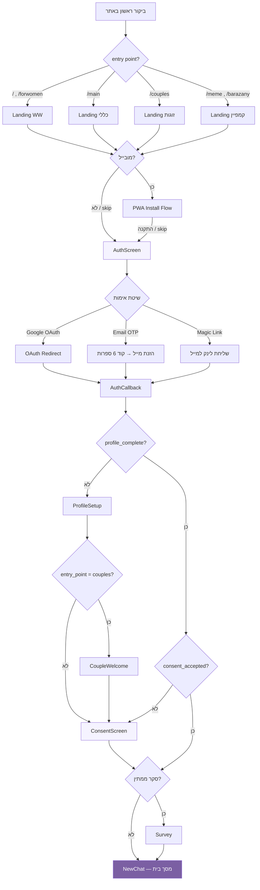

### ג.2 מכונת מצבים — שיחה (Conversation State Machine)

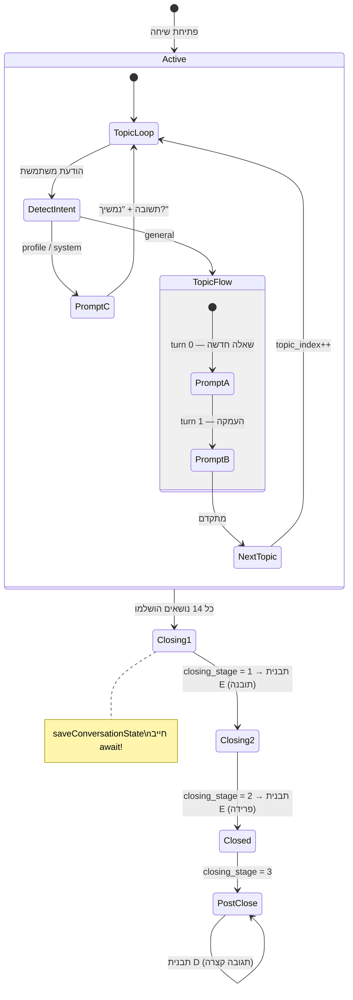

### ג.3 ערוצי שיחה ומצביהם

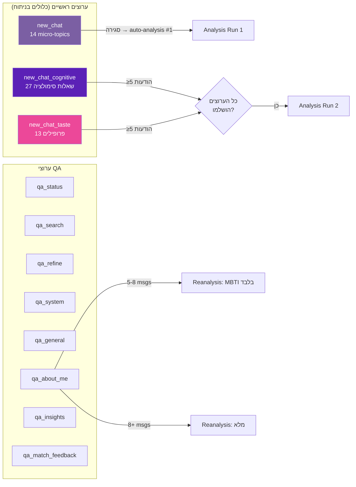

### ג.4 זרימת ניתוח (Analysis Pipeline)

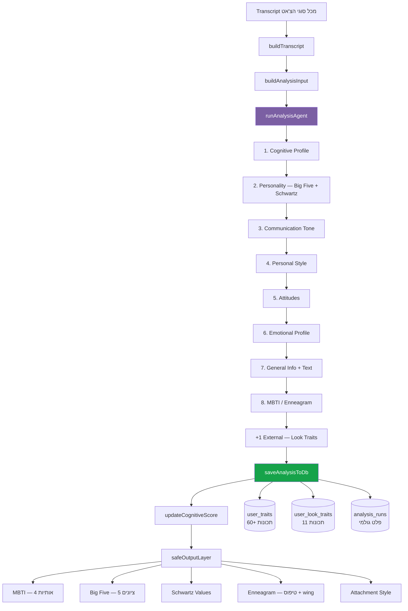

### ג.5 אלגוריתם התאמה (Matching Algorithm)

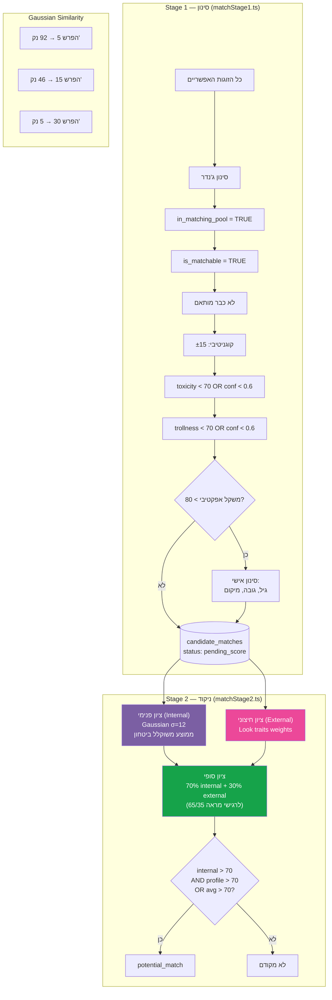

### ג.6 זרימת סטטוס התאמה (Match Status Flow)

```mermaid
stateDiagram-v2
    [*] --> pending_score: candidate_matches

    state candidate_matches {
        pending_score --> scored: Stage 2 scoring
        scored --> potential_match: עובר סף
        scored --> expanded_potential_match: עובר סף מורחב
    }

    potential_match --> pre_match: Admin "שלח התאמה"
    expanded_potential_match --> pre_match: Admin "שלח התאמה"

    state matches {
        pre_match --> waiting_for_photo: חסרה תמונה
        pre_match --> waiting_first_rating: כרטיס נשלח

        waiting_for_photo --> waiting_first_rating: תמונה הועלתה

        waiting_first_rating --> pending_second_rating: צד ראשון דירג
        pending_second_rating --> waiting_second_rating: כרטיס נשלח לצד שני
        waiting_second_rating --> in_match: שני הצדדים אישרו
        waiting_second_rating --> cancelled: דירוג שלילי

        waiting_first_rating --> cancelled: דירוג שלילי
        in_match --> cancelled: אחד הצדדים ביטל
    end

    note right of in_match: צ'אט ישיר פתוח\nבין המותאמות
    note right of cancelled: match_card_sent_at IS NOT NULL\nנדרש בתצוגה למשתמשת
```

### ג.7 מערכת Nudges — תזמון

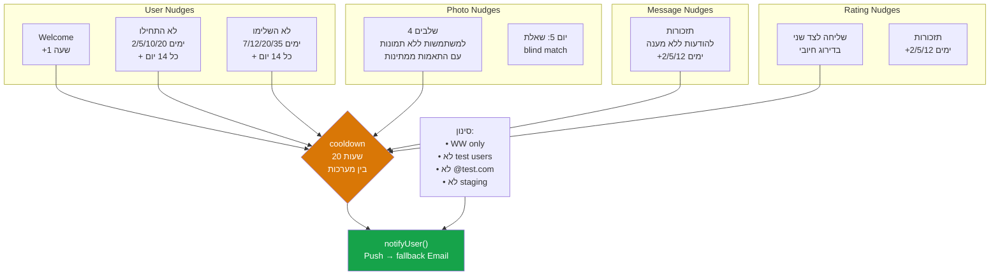

### ג.8 Completion Pipeline

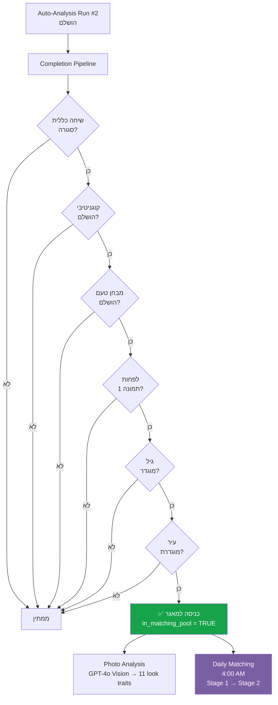

### ג.9 אימות ו-Middleware (Auth Flow)

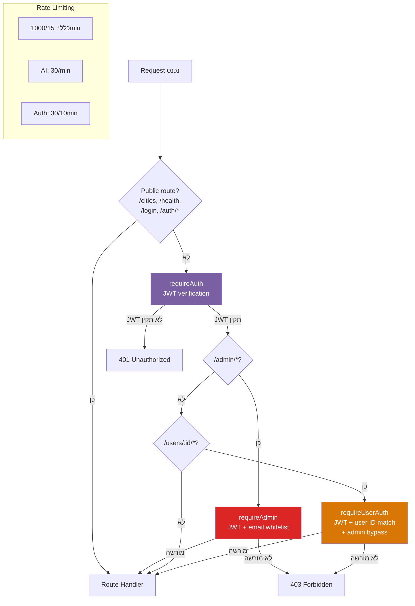

### ג.10 ERD — טבלאות מרכזיות (Entity Relationship)

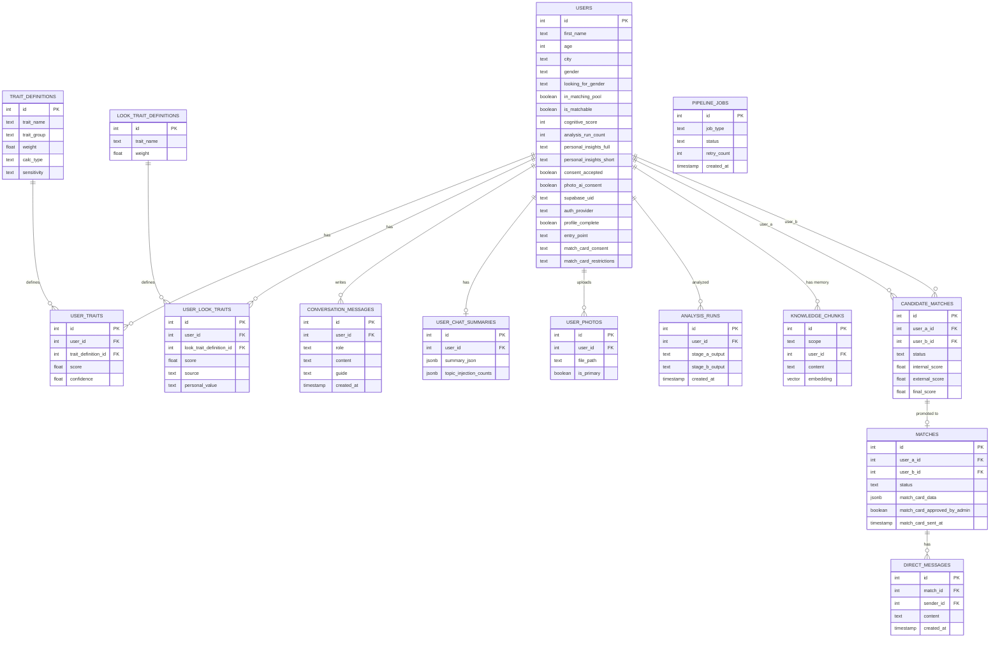

### ג.11 ארכיטקטורת מערכת — תמונה כללית

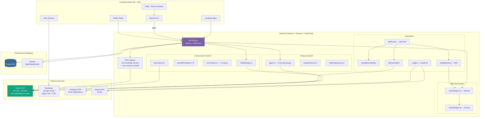

### ג.12 Sequence — זרימת הודעת צ'אט

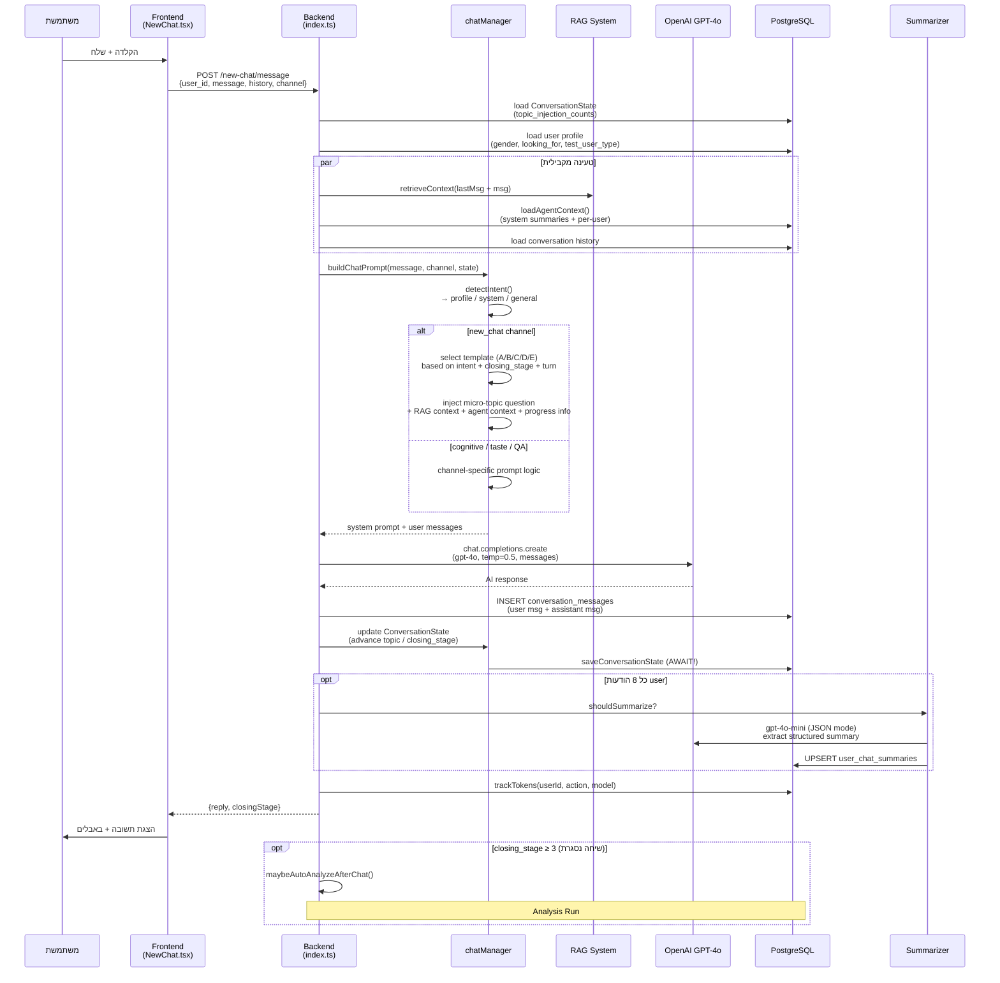

### ג.13 Sequence — העלאת תמונה

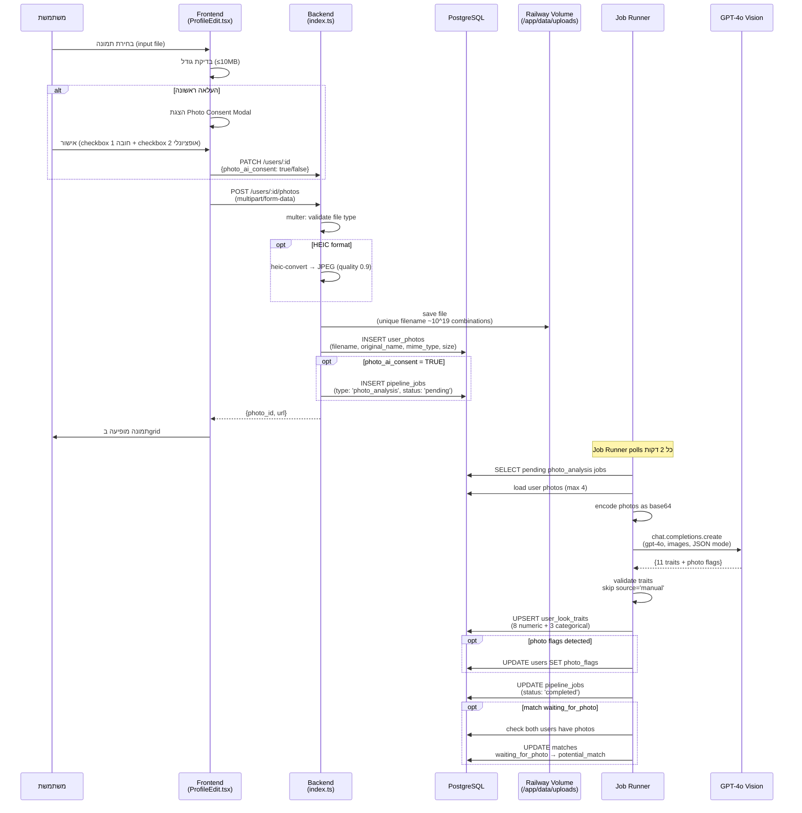

### ג.14 Sequence — זרימת דירוג (Rating Flow)

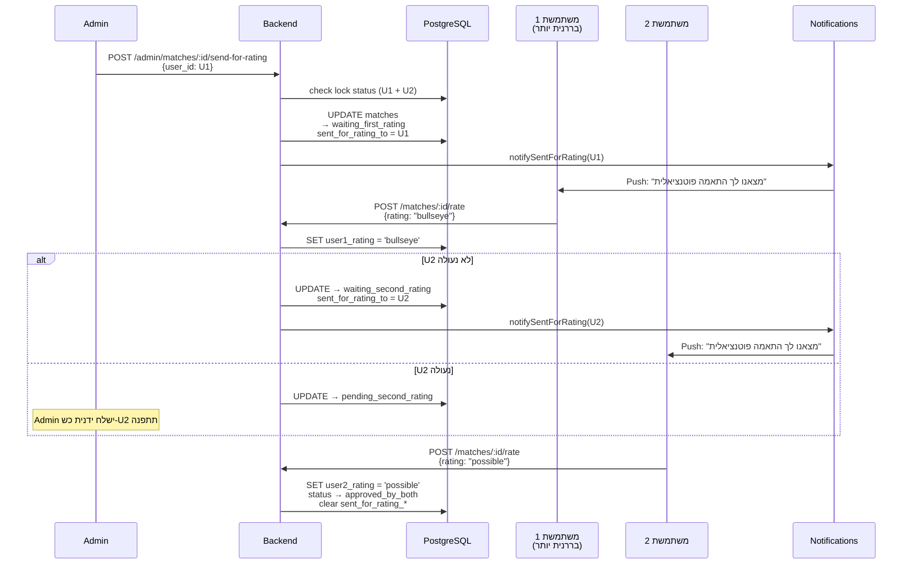
